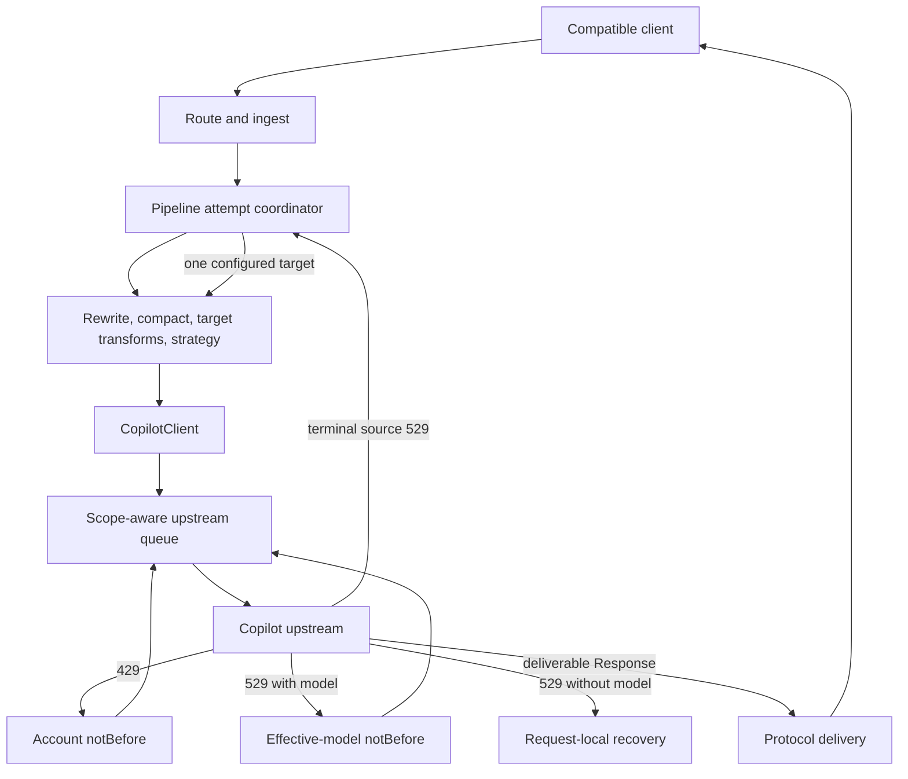
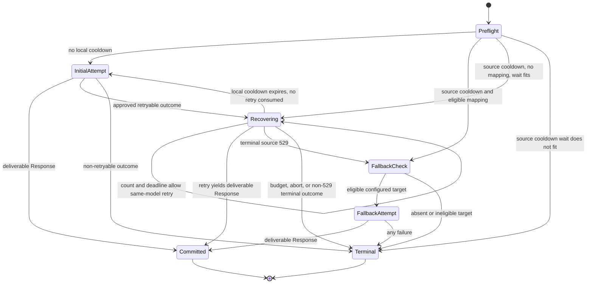
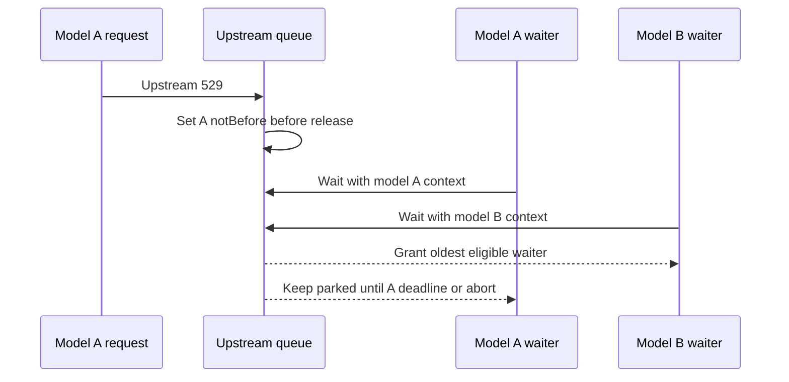

# Upstream Capacity Recovery - Plan

> **Status: completed.** Implemented on 2026-08-04 by commit
> `7124d596475bc1eb9cc5bc821992150633cb24c4` (`feat: isolate and bound upstream
> capacity recovery (#72)`). This document is a historical implementation
> record, not an active work queue. Present-tense or future-tense wording below
> describes the pre-implementation baseline and the contract used for that
> change.

## Goal Capsule

- **Objective:** Bound recovery time for Copilot capacity and connection failures without letting one overloaded model stall unrelated models or replay an accepted generation.
- **Authority:** Product Requirements and Key Decisions define behavior. Key Technical Decisions define the mechanism. Implementation Units may refine local details but must not weaken either contract.
- **Execution profile:** Deep, cross-protocol, concurrency-sensitive, and Bun/Node-sensitive. Start with deterministic regression coverage. Do not use the live Copilot matrix for validation.
- **Stop conditions:** Stop for a product decision if implementation evidence requires broad connection-error replay, implicit model substitution, a public protocol extension, or a change to the accepted cooldown scopes.
- **Tail ownership:** The implementation owns focused regression tests, the full CI-equivalent gate, packaged Bun/Node smoke, and matching design/operator documentation. Release and publication are outside this plan.

---

## Product Contract

### Summary

Add scoped capacity cooldowns, bounded pre-response retry, and an opt-in one-hop overload fallback across Anthropic Messages, OpenAI Responses, and Chat Completions.
The change must reduce retry-amplified latency while preserving protocol schemas, cancellation, actual-model transparency, and the existing no-mid-stream-replay boundary.

### Historical Problem Frame (pre-implementation baseline)

Before commit `7124d59`, `UpstreamRequestQueue` treated both `429` and `529` as one process-global cooldown and retried capacity responses up to five times.
That policy could add minutes of backoff and could keep Sol, Terra, or another Claude model behind an Opus-specific overload.
It also dropped `Retry-After` when the final upstream error became an `HTTPError`, which left Claude Code and other SDK clients without the provider's pacing signal.

At that baseline, the normal proxy streaming path was incremental and did not explain the observed long tails.
The recovery path was the controllable multiplier: queue wait, global cooldown, five retries, and downstream SDK retries could stack beneath a single user turn.
The implemented plan narrowed that multiplier without adding a general circuit breaker or an implicit model-selection system.

### Actors

- A1. **Agent client:** Claude Code, Codex, or another compatible client that submits a generation and may apply its own SDK retries.
- A2. **Proxy operator:** Configures recovery limits and overload mappings, then diagnoses retry and fallback decisions from correlated logs.
- A3. **Copilot upstream:** Returns an explicit capacity response, accepts a generation, or fails before a usable `Response` is available.

### Requirements

**Cooldown and isolation**

- R1. An upstream `429` must establish an account-global cooldown before the triggering queue lease is released.
- R2. An upstream `529` with a known effective upstream model must establish a cooldown only for that final serialized model before the triggering lease is released.
- R3. A model-less `529` must remain request-scoped and must not be promoted to an account-global cooldown.
- R4. An eligible request must bypass cooled-model waiters while preserving FIFO order among eligible pending work. If cooled waiters fill pending depth but a global slot is free, they must not cause the eligible request to fail admission.
- R5. A shared cooldown wake must use one coalesced timer and grant no more than the currently free global slots. Scoped cooldowns must not cancel active streams, and full-slot/global-depth saturation remains shared.

**Bounded replay**

- R6. The proxy must default to one retry after the original request and accept at most two configured retries across capacity and approved connection failures.
- R7. The existing first attempt keeps the normal upstream timeout. A separate recovery budget defaults to 60 seconds, supports `1..120` seconds, starts at the first approved retryable outcome, and bounds all later cooldown waits, queue acquisition, retry attempts until `Response`, and overload fallback.
- R8. A recovery attempt that cannot obtain a `Response` before the remaining recovery deadline must stop. Once a successful `Response` commits the request, normal body/stream timeout handling resumes without the recovery timer.
- R9. Generation requests may retry only explicit pre-delivery `429`/`529` responses and a measured allowlist of connection-establishment failures. Effect-free requests retain their existing transient-status policy within the same count and elapsed limits.
- R10. Caller aborts, proxy timeouts, TLS or configuration failures, ambiguous resets, generic fetch errors, body parse failures, and response-stream failures must not be retried as connection-establishment failures.
- R11. Except for statuses that the call site explicitly authorizes the queue to handle privately, `fetch()` resolving to any upstream `Response` is the replay commit point. A `200` stream that fails before its first downstream event must not be retried or sent to fallback.

**Retry pacing**

- R12. A valid `Retry-After` value is a lower bound. The proxy must never shorten that wait and issue an early same-model retry.
- R13. When a valid `Retry-After` does not fit the remaining recovery budget, the proxy must skip the same-model retry and retain the full account/model cooldown deadline. Preserve or synthesize the source header only when the source capacity outcome remains terminal; after target fetch begins, expose only retry metadata from the target result.
- R14. Without a valid `Retry-After`, the proxy must use full jitter in the range from zero through the smallest of computed backoff, configured maximum delay, and remaining recovery time. The maximum-delay setting must not shorten a valid server minimum.
- R15. Every cooldown/backoff wait and queue waiter must be abortable and must release its timer, listener, and lease state on cancellation.

**Opt-in overload fallback**

- R16. Overload fallback must be disabled by default and configured as an exact effective-model source-to-target map.
- R17. Fallback may run once only after a terminal source-model `529` or a pre-existing local source-model cooldown. It must never run for `429`, other HTTP statuses, connection failures, validation failures, cancellation, timeout, or post-`Response` failures.
- R18. A valid different-model fallback may bypass the source model's cooldown, but it must not bypass an account cooldown or a cooldown already active for the target model.
- R19. The fallback target must be an advertised, distinct model that can satisfy the request through an existing execution strategy. The pipeline must reapply target-dependent transforms, capability checks, and strategy selection before dispatch.
- R20. Fallback gets one dispatch and no fresh retry allowance. With the default policy, the maximum is the original attempt, one same-model retry, and one fallback attempt.
- R21. An invalid or locally cooled fallback target must preserve the source `529`: the upstream source response when present, or a locally synthesized `529` with remaining `Retry-After` for a pre-existing cooldown. A dispatched fallback failure must surface the fallback attempt's actual error and must never start another fallback.
- R22. Every successful protocol response and Responses emulator record that contains a model identity must report the actual served model.

**Observability and compatibility**

- R23. Every retry, cooldown, budget, fallback, grant, and admission decision must emit a structured, request-correlated event with retry count, status or normalized connection class, effective model, scope, active/max slots, pending/max depth, queue wait, delay source, delay, elapsed/remaining budget, `next_retry_at`, and terminal decision.
- R24. Logs must not contain prompts, payload bodies, tokens, authorization headers, credential-derived account identifiers, or unbounded raw upstream errors.
- R25. Final errors must retain protocol-compatible bodies and the standard `Retry-After` header. The proxy must not add retry-progress SSE frames or depend on custom response headers for live status.
- R26. Messages, Responses, and Chat Completions must share the same cooldown, retry, fallback, cancellation, and diagnostic semantics under Bun and Node.

### Key Decisions

- **Capacity scope and isolation** `(session-settled: user-approved - chosen over one process-global capacity cooldown: a model admission failure must not stall unrelated models.)` A `429` is treated as account-global. A `529` with a known effective model is model-scoped; a model-less `529` remains request-scoped. Governs R1-R5.
- **Request-scoped connection recovery** `(session-settled: user-approved - chosen over immediately surfacing every connection failure: one bounded retry can recover an admission/connection stall.)` Only measured connection-establishment failures qualify, with the duplicate-generation risk documented. Governs R6-R10.
- **No replay after upstream acceptance** `(session-settled: user-approved - chosen over retrying a stream that has not emitted client-visible data: upstream acceptance is already enough to make replay unsafe.)` The commit boundary is `Response`, not first downstream SSE output. Governs R11.
- **Bounded recovery and server pacing** `(session-settled: user-approved - chosen over five independent backoff delays: proxy retries must not multiply Claude Code SDK retries into multi-minute hidden waits.)` Retry count, one recovery deadline, and `Retry-After` jointly bound recovery. Governs R6-R15.
- **Explicit overload fallback** `(session-settled: user-approved - chosen over implicit or process-wide model switching: changing models affects capability, quality, and model identity.)` One configured `529` fallback hop is allowed and is disabled by default. Governs R16-R22.
- **Correlated operator visibility** `(session-settled: user-approved - chosen over prose-only retry warnings: the operator needs request-level retry status and next-action timing.)` Structured logs and standard retry headers provide the diagnostic contract without changing SSE schemas. Governs R23-R26.

### Key Flows

- F1. **Same-model capacity recovery**
  - **Trigger:** A3 returns `429` or `529` before the response is committed.
  - **Actors:** A1, A2, A3.
  - **Steps:** The queue records the correct cooldown before release, checks count and recovery time, waits without a slot, then reacquires and retries only when the server minimum fits.
  - **Outcome:** The request succeeds within budget or returns the final protocol-compatible capacity error with retry metadata.
  - **Covered by:** R1-R15, R23-R26.
- F2. **Cross-model isolation**
  - **Trigger:** Model A is cooled by `529` while model B is waiting.
  - **Actors:** A1, A2.
  - **Steps:** The scheduler skips model-A waiters and grants model B when account state and concurrency permit.
  - **Outcome:** Model B proceeds without waiting for model A's cooldown.
  - **Covered by:** R2-R5, R23.
- F3. **Overload fallback**
  - **Trigger:** A source model reaches terminal `529`, or another request already established its model cooldown.
  - **Actors:** A1, A2, A3.
  - **Steps:** The pipeline checks the explicit mapping, validates an eligible target, rebuilds target-dependent processing from pristine post-ingest input, then dispatches once.
  - **Outcome:** The target succeeds and is disclosed, or the correct source/target error is returned without a chain.
  - **Covered by:** R16-R26.
- F4. **Committed response failure**
  - **Trigger:** A successful upstream `Response` later fails during JSON or SSE consumption.
  - **Actors:** A1, A3.
  - **Steps:** Existing protocol translation emits or returns the terminal error and releases the stream lease.
  - **Outcome:** Exactly one upstream generation occurred. No retry or fallback starts.
  - **Covered by:** R11, R15, R25-R26.

### Acceptance Examples

- AE1. **Account cooldown:** Given model A returns `429`, when models A and B are queued, then neither dispatches before the account deadline and the triggering lease cannot release a waiter through a race. Covers R1, R4.
- AE2. **Model isolation:** Given model A returns `529`, when another A waiter is ahead of model B, then B dispatches first while A remains parked. Covers R2, R4.
- AE3. **Final cooldown:** Given retry count is zero or exhausted, when a capacity response is returned, then the correct cooldown is still installed before the lease is released. Covers R1-R3.
- AE4. **Connection retry:** Given an allowlisted pre-connection failure followed by success, when the call site permits replay, then only that request retries once and no shared cooldown is created. Covers R6, R9-R10.
- AE5. **Server delay exceeds budget:** Given source model A returns `529` with a valid `Retry-After` longer than the remaining recovery time, when an eligible fallback exists, then the same-model retry is skipped and the fallback may dispatch immediately; otherwise the original `529` and full retry header are returned. Covers R12-R13, R17-R18.
- AE6. **Pre-existing model cooldown:** Given model A is locally cooled and model B is not, when a new A request has a compatible mapping to B, then it may use B without waiting; without a mapping it waits only while the cooldown fits its recovery budget and otherwise receives a synthetic `529` with remaining `Retry-After`. Covers R7, R13, R17-R18.
- AE7. **Commit before first event:** Given upstream resolves a streaming `200` and disconnects before its first SSE event, when stream consumption fails, then the fetch count remains one and no fallback occurs. Covers R11.
- AE8. **Target-dependent rerun:** Given a compact Messages request resolves source model A and A reaches terminal `529`, when target B is selected, then fallback is applied after normal rewrite/compact resolution and B's transforms and strategy are selected exactly once. Covers R19-R20.
- AE9. **Fallback rejection and failure:** Given an unknown, same, incompatible, or locally cooled target, then the source `529` is preserved; given an eligible dispatched target returns `529`, then the target `529` is surfaced without retry or another fallback. Covers R18-R21.
- AE10. **Cross-protocol telemetry:** Given the same retry sequence through each generation protocol, then each preserves its public error schema and standard retry header while logs contain the same redacted decision fields and actual served model. Covers R22-R26.
- AE11. **Cancellation cleanup:** Given a client abort during cooldown, queue wait, or backoff, then no later dispatch occurs and all waiters, timers, listeners, and leases are released. Covers R15.
- AE12. **Admission isolation:** Given cooled model-A waiters fill pending depth while one global slot is free, when eligible model B arrives, then B dispatches; if all global slots are occupied, B receives the documented shared queue-full outcome. Covers R4-R5.
- AE13. **Bounded wake:** Given maximum pending depth shares one cooldown deadline, when the deadline expires with N free slots, then one timer wakes the queue, at most N eligible waiters dispatch in FIFO order, and the rest remain pending. Covers R4-R5.
- AE14. **Active-stream saturation:** Given active streams occupy every slot while cooled A and eligible B wait, when one stream releases, then B receives that slot and diagnostic events distinguish slot saturation from cooldown. Covers R4-R5, R23.

### Success Criteria

- The default recovery path performs at most three upstream generation attempts: original, one retry, and one configured fallback.
- Per inbound proxy request, the configured ceiling is `1 + maxRetries + at most 1 fallback`; an outer SDK attempt count multiplies that ceiling and remains outside proxy control.
- No same-model `529` cooldown delays or rejects an unrelated eligible model when account state and a global concurrency slot permit immediate dispatch.
- Coalesced wake-up grants never exceed free global slots, and telemetry distinguishes cooldown, active-slot saturation, pending-depth saturation, and queue-full rejection.
- No automatic replay occurs after a successful upstream `Response`, including a stream failure before its first event.
- A valid `Retry-After` is never shortened to force an automatic retry, and final capacity errors retain a usable standard header.
- Every recovery decision is attributable to one request ID without exposing request content or credentials.
- Bun and Node fixtures prove equivalent status/header, abort, connection-classification, and no-replay behavior.

### Scope Boundaries

**In scope**

- The shared Copilot queue and all current queue consumers.
- Generation parity for `/v1/messages`, `/v1/responses`, and `/v1/chat/completions`.
- Existing effect-free retry behavior, adjusted only to share the bounded count, recovery timing, cleanup, and logging rules.
- `config.json`, CLI defaults/help, startup diagnostics, error/header mapping, model trace, tests, and design/operator docs.

#### Deferred to Follow-Up Work

- Adaptive concurrency, per-model admission reservations, per-scope queue-depth quotas, or retry token buckets.
- A circuit breaker, cross-model `529` escalation, or provider-health inference.
- A metrics/admin endpoint for live cooldown maps and counters.
- Multi-account queue partitioning and credential-scoped account keys.
- Client-specific retry UI beyond existing terminal logs and standard headers.

**Outside this product's identity**

- Mid-stream replay or continuation after a partial generation.
- Implicit, cross-family, or Auto model selection.
- Fallback on account-global `429`, generic `5xx`, connection errors, timeouts, validation failures, or client abort.
- Non-standard SSE progress events or payload-schema extensions.

---

## Planning Contract

### Key Technical Decisions

- KTD1. **Use a scope-aware `notBefore` scheduler, not a circuit breaker.** Keep one account deadline and one map keyed by effective upstream model. Waiters carry model context, drain selects the oldest eligible waiter, and an immediately grantable eligible request is not rejected only because cooled waiters fill pending depth. One wake timer grants at most free global slots. This is the minimum state that satisfies R1-R5 and preserves the singleton queue.
- KTD2. **Install cooldown before releasing a lease.** `(session-settled: user-approved - chosen over a shared process-global cooldown: cooldown scope changes, but the proven release-order invariant remains.)` Apply both retrying and final-response cooldown decisions before release, including zero-retry and exhausted paths. The regression must observe dispatch order rather than timer existence. Implements R1-R4.
- KTD3. **Let the queue mint one internal recovery record at the first retryable outcome.** The record owns the absolute monotonic deadline, retry count, serialized source model, cooldown scope/deadline, and preserved public error. The normal first attempt keeps `upstreamTimeoutSeconds`; the default 60-second deadline covers later cooldown waits, acquisition, and time-to-`Response`. A typed terminal handoff lets the pipeline consume the same record for fallback with zero retries, so no layer creates a second budget. Implements R7-R8, R20.
- KTD4. **Use one retry counter and one separate fallback hop.** `(session-settled: user-approved - chosen over five proxy retries or a fresh retry loop after model switch: downstream SDK retry amplification must stay bounded.)` Capacity and allowlisted connection retries share `maxRetries`, default `1`, hard maximum `2`. A fallback dispatch uses no retry allowance of its own. Implements R6, R9, R20.
- KTD5. **Treat `Retry-After` as a minimum for automatic retry.** `(session-settled: user-approved - chosen over clamping a provider delay and retrying early: an elapsed cap must stop recovery rather than violate provider pacing.)` Strictly accept integer seconds and HTTP-date, retain the current fractional-seconds form only as a full-string provider extension, and use injected wall/monotonic clocks. Store the full server deadline in cooldown state. Use `maxDelayMs` only for computed backoff. Implements R12-R14.
- KTD6. **Retry only measured connection-establishment failures.** `(session-settled: user-approved - chosen over surfacing every connection failure: a single request-scoped retry is useful, but generic POST replay can duplicate quota.)` Build an allowlist from no-quota Bun and Node probes for DNS resolution, refusal, and other demonstrably pre-connection failures. Exclude aborts, all timeouts, resets, TLS/configuration failures, top-level `TypeError`, and unknown nested codes. This is a suboptimal-but-workable conflict with generic HTTP guidance: completion `POST` is not idempotent, so the plan accepts a bounded duplicate-cost risk rather than claiming exactly-once behavior. Implements R9-R10.
- KTD7. **Make upstream `Response` the replay commit point and separate signal lifetimes.** Caller cancellation and the normal upstream timeout remain authoritative across attempts and delivery. Each attempt owns detachable pre-`Response` recovery listeners. On deliverable `Response`, disarm recovery synchronously without removing caller cancellation or the normal timeout; cancel private retry bodies before another attempt. Implements R8, R11, R15.
- KTD8. **Coordinate overload fallback in `runPipeline`, not the transport queue.** `(session-settled: user-approved - chosen over transport-only model substitution: the target can change transforms, capability validation, strategy, and public model identity.)` Use the model from the serialized source payload for cooldown and mapping lookup. Preserve pristine post-ingest input, reproduce source rewrite/compact resolution, confirm the effective source, then apply the exact advertised target once as the final `OVERLOAD_FALLBACK` step. An explicit preparation boundary reuses existing transforms and registry selection; preflight rejection preserves the source error, while any failure after target fetch begins is the target result. Implements R16-R22.
- KTD9. **Use exact one-hop configuration with atomic queue admission.** `overloadFallbacks` is a `config.json` record keyed by final serialized source ID with one exact advertised target ID. Reject blank, same-source, and cyclic entries; ignore invalid runtime targets with a warning. The queue rechecks account and target cooldown at fallback grant time. If state changed after preflight, no target fetch occurs and the source `529` remains terminal. Do not add glob precedence, multiple targets, or a fallback graph. Implements R16, R18-R21.
- KTD10. **Use structured logs and standard response metadata.** `(session-settled: user-approved - chosen over opaque retry warnings or protocol extensions: operators need live decisions while clients need compatibility.)` Thread the existing request ID and model trace into recovery. Emit allowlisted structured fields through `consola`, append `OVERLOAD_FALLBACK` to the access-log model trace, and preserve only safe standard retry metadata on final responses. Implements R22-R26.
- KTD11. **Keep shared full-slot and full-depth saturation, but remove avoidable cooldown admission failure.** An eligible request may use a free slot even when cooled waiters occupy pending depth. When all slots are occupied and pending depth is full, existing shared rejection remains. Telemetry must expose both states before any later per-model admission control.

### High-Level Technical Design

#### Component flow

The queue owns admission, retry pacing, and cooldown state.
The pipeline owns model-dependent work and the single fallback decision.
Neither layer re-enters recovery after delivery owns the `Response`.

#### Recovery state machine

The recovery deadline begins only on entry to `Recovering`.
Fallback is one terminal branch of the same recovery operation, not a nested retry loop.

#### Concurrent cooldown scheduling

An account deadline stops all grants.
A model deadline affects only waiters with the same effective model.

### Sequencing

1. Establish policy/config plus the request-correlation and recovery-record foundation.
2. Change scheduler state and retry pacing without adding fallback.
3. Add connection classification and typed final recovery metadata.
4. Add pipeline fallback from pristine post-ingest input.
5. Complete protocol error mapping, saturation observability, Node coverage, and documentation.

### System-Wide Impact

- **Client protocols:** Error bodies remain Anthropic/OpenAI compatible. Only standard `Retry-After`, existing `x-request-id`, and actual model fields cross the public boundary.
- **Concurrency:** Model cooldown no longer creates head-of-line or free-slot admission blocking. Wake-up is capped by free slots. Active streams still hold global slots, and full-slot/full-depth saturation can still reject work.
- **Cancellation:** Client abort must stop cooldown wait, backoff, acquisition, pre-`Response` recovery fetch, and pending fallback without disturbing shared cooldown deadlines.
- **SDK stacking:** Claude Code and OpenAI/Anthropic SDK retries remain outside proxy control. Per inbound request, upstream attempts are bounded by `1 + maxRetries + fallback`; an SDK's outer request count multiplies that bound and adds its own waits.
- **Model routing:** Missing-model fallback, model rewrites, compact routing, and overload fallback remain distinct trace steps. The overload target is applied last for the fallback attempt.
- **Responses state:** The emulator must persist the actual fallback model and must not retain a failed source attempt as a successful response.
- **Runtime parity:** Node requires retry bodies to be consumed or cancelled and exposes different fetch error shapes. Bun-only green tests are insufficient evidence for these paths.
- **Security and privacy:** Diagnostic data is allowlisted. No token-derived account key is required while the proxy remains single-account.

### Risks and Mitigations

| Risk | Consequence | Mitigation |
|---|---|---|
| Connection error occurred after upstream accepted a generation | Duplicate quota use or tool work | Narrow to measured establishment failures, one shared retry count, explicit logs, and no exactly-once claim |
| Fallback changes capabilities or strategy | Silent request degradation | Rebuild from pristine input, run normal target validation, reject incompatible targets, disclose actual model |
| Proxy and SDK retries multiply | Multi-minute hidden latency | Default one proxy retry, hard maximum two, one 60-second recovery deadline, no retry on fallback |
| `Retry-After` is very large | Long local cooldown | Do not wait beyond the request budget; retain the server deadline and surface the standard header |
| Retry response body is left unread | Node connection-pool stalls | Cancel the private response body before release/retry and verify cleanup under both runtimes |
| Cooldown write races with lease release | Same-scope waiter escapes early | Preserve cooldown-before-release and use direct dispatch witnesses in tests |
| Shared cooldown expiry wakes many waiters | Retry burst or repeated timers | Coalesce the wake and cap grants at free global slots; verify maximum pending depth deterministically |
| Elysia lifecycle status differs from returned native `Response` | Incorrect terminal logs or missing headers | Populate request-scoped diagnostics at dispatch and assert required native response status/headers under Bun and Node |
| Full global slots plus pending depth reject unrelated work | Shared saturation remains after cooldown isolation | Grant eligible work when a slot is free, expose slot/depth state, and defer per-scope reservations |

---

## Implementation Units

### U1. Recovery policy and configuration contract

- **Goal:** Establish one validated configuration and policy vocabulary for scoped cooldown, retry count, recovery timing, and overload mappings.
- **Requirements:** R1-R3, R6-R7, R12-R14, R16, R23-R26; KTD1, KTD3-KTD5, KTD9.
- **Dependencies:** None.
- **Files:**
  - Modify `src/lib/config.ts`.
  - Modify `src/state/config-store.ts`.
  - Modify `src/start.ts`.
  - Modify `src/clients/factory.ts`.
  - Modify `src/lib/error.ts`.
  - Modify `tests/config-state.test.ts`.
  - Modify `tests/upstream-transport.test.ts`.
- **Approach:**
  1. Change `upstreamQueueMaxRetries` from default `5` to default `1` and validate the supported range `0..2` for both config and CLI input.
  2. Add `upstreamRecoveryBudgetSeconds` with default `60`, valid range `1..120`, and wire the same effective value to the queue and pipeline.
  3. Add `overloadFallbacks` as an optional exact string record. Reject blank, self, and direct-cycle mappings at configuration load. Leave missing configuration disabled.
  4. Replace the old boolean capacity-scope assumption with one canonical status-to-scope policy that preserves transient-status reuse for token/effect-free operations.
  5. Keep queue options on the existing startup-to-factory path. Add only the request-time fallback/budget getters that the pipeline needs to `ConfigStore`.
- **Patterns to follow:** Zod field-by-field fallback in `src/lib/config.ts`; direct queue wiring in `src/start.ts`; shared status predicates in `src/lib/error.ts`.
- **Test scenarios:**
  - A missing config uses one retry, 60 seconds, and no overload mappings.
  - Retry values `0`, `1`, and `2` are accepted; negative, fractional, and greater-than-two values warn and fall back without widening the retry ceiling.
  - Recovery budgets `1`, `60`, and `120` are accepted; zero, fractional, and greater-than-120 values warn and preserve other individually valid fields.
  - Blank, self, and two-node cyclic fallback entries are rejected while unrelated valid mappings remain usable.
  - `429`, `529`, and non-capacity transient statuses resolve to account, model, and no shared scope respectively.
  - CLI overrides and config values produce one effective queue/pipeline policy without divergent defaults.
- **Verification:** Config parsing, startup wiring, and status classification expose one effective policy with no new dependency or secret-bearing output.

### U8. Request correlation and recovery trace foundation

- **Goal:** Establish one request-scoped diagnostic and recovery record before scheduler, retry, and fallback behavior begins emitting decisions.
- **Requirements:** R7-R8, R20, R23-R26; KTD3-KTD4, KTD10.
- **Dependencies:** U1.
- **Files:**
  - Modify `src/server.ts`.
  - Modify `src/routes/messages/route.ts`.
  - Modify `src/routes/messages/handler.ts`.
  - Modify `src/routes/responses/route.ts`.
  - Modify `src/routes/responses/handler.ts`.
  - Modify `src/routes/chat-completions/route.ts`.
  - Modify `src/routes/chat-completions/handler.ts`.
  - Modify `src/pipeline/runner.ts`.
  - Modify `src/clients/upstream-queue.ts`.
  - Modify `src/lib/request-logger.ts`.
  - Modify `tests/reliability.test.ts`.
  - Modify `tests/pipeline-internals.test.ts`.
- **Approach:**
  1. Thread the server-derived request ID through each generation route and the common pipeline into upstream request context.
  2. Define one internal recovery record carrying request ID, absolute monotonic deadline when recovery starts, retry count/limit, final serialized source model, cooldown state, safe public error metadata, and structured decision fields.
  3. Keep the record inert on a normal first attempt. Let U2/U3 create or advance it only when a local cooldown or approved retryable outcome starts recovery.
  4. Provide one structured event helper over existing `consola`; later units add their decision-specific values rather than introducing route-local log formats.
  5. Keep the record internal. Public response mapping continues through existing error/delivery contracts.
- **Patterns to follow:** Root Elysia request-ID derivation in `src/server.ts`; generic route-to-pipeline parameters in the three handlers; mutable request model mapping in `src/lib/request-logger.ts`.
- **Test scenarios:**
  - A generated request ID and a caller-supplied `x-request-id` each reach pipeline and queue context unchanged.
  - Messages, Responses, and Chat Completions create the same recovery record shape.
  - A normal success emits no retry/fallback event and does not create a recovery deadline.
  - Structured event serialization omits payload/body/header objects and credential-derived values.
  - The same record can cross a typed queue-to-pipeline handoff without changing its deadline or retry count.
- **Verification:** Every later recovery unit has one request ID, one record, and one event vocabulary available before it changes behavior.

### U2. Scope-aware cooldown scheduler

- **Goal:** Replace the scalar global cooldown with account/model deadlines and eligibility-aware waiter draining.
- **Requirements:** R1-R5, R13, R15, R23; KTD1-KTD2, KTD11; F1-F2; AE1-AE3, AE11-AE14.
- **Dependencies:** U1, U8.
- **Files:**
  - Modify `src/clients/upstream-queue.ts`.
  - Modify `src/clients/copilot-client.ts`.
  - Modify `src/clients/types.ts`.
  - Modify `src/clients/factory.ts`.
  - Modify `tests/upstream-queue-retry.test.ts`.
  - Modify `tests/upstream-transport.test.ts`.
- **Approach:**
  1. Add effective upstream model and request correlation to `UpstreamRequestContext`; pass the model actually serialized by each client method.
  2. Keep one account deadline and a lazily cleaned model-deadline map. A model-less `529` records request-local recovery state only.
  3. Define a typed, read-only cooldown admission outcome through the existing queue/client/factory boundary. A pre-existing source-model cooldown can hand the same recovery record to U4 without exposing queue state or inferring from a generic error.
  4. Store waiter context and abort cleanup with each waiter. Drain the oldest eligible waiter, preserve FIFO among eligible entries, and schedule one wake for the earliest relevant deadline.
  5. Before queue-full rejection, grant an immediately eligible request when a global slot is free. At shared expiry, grant at most free slots and leave the remaining waiters pending.
  6. Write or extend cooldown before lease release on retrying, final, zero-retry, and locally synthesized cooldown paths.
  7. Leave active streams and full-slot/full-depth saturation shared; report those states separately from cooldown delay.
- **Execution note:** Start with direct concurrent regression witnesses. Each new branch must fail when its cooldown/scheduler change is removed; timer-presence assertions alone are insufficient.
- **Patterns to follow:** Lease lifetime and abort handling in `src/clients/upstream-queue.ts`; regression-test discipline in `docs/solutions/testing/regression-test-must-fail-first.md`.
- **Test scenarios:**
  - Covers F1 / AE1. A `429` from model A blocks admitted A and B waiters until the account deadline.
  - Covers F2 / AE2. A `529` from model A parks the next A waiter while a later B waiter dispatches.
  - Two model cooldowns with different deadlines wake independently and expired map entries are removed.
  - Covers AE12. Cooled model-A waiters at maximum pending depth do not reject eligible B when a slot is free; B receives the existing queue-full result when every slot and pending position is occupied.
  - Covers AE13. Maximum pending depth at one deadline uses one wake timer and grants exactly the currently free slots in eligible FIFO order.
  - A first post-wake capacity response extends cooldown before another same-scope waiter can escape.
  - A model-less `529` does not create an account or arbitrary endpoint-wide cooldown.
  - Covers AE3. Exhausted and zero-retry capacity responses install the correct cooldown before release.
  - A model waiter cancelled before its deadline is removed and cannot dispatch later.
  - Active streams are not cancelled when a cooldown is installed, and their leases still release only on close/cancel.
  - Covers AE14. When all slots are active streams, releasing one grants eligible B ahead of cooled A and records active/max slot plus pending/max depth state.
  - A typed local source-model cooldown outcome carries the original deadline and recovery record without consuming a retry.
  - Eligible FIFO order is stable when cooled waiters are skipped.
- **Verification:** Under deterministic clocks/timers, account and model deadlines govern only their documented scopes with no release race, leaked waiter, or cross-model head-of-line blocking.

### U3. Bounded pre-response retry and cleanup

- **Goal:** Apply one retry counter and recovery deadline to capacity and approved connection failures while preserving the `Response` commit boundary.
- **Requirements:** R6-R15, R23-R26; KTD3-KTD7; F1, F4; AE3-AE5, AE7, AE11.
- **Dependencies:** U1, U2, U8.
- **Files:**
  - Modify `src/clients/upstream-queue.ts`.
  - Modify `src/clients/copilot-client.ts`.
  - Modify `src/lib/timeout-error.ts`.
  - Modify `src/lib/error.ts`.
  - Modify `tests/upstream-queue-retry.test.ts`.
  - Modify `tests/upstream-transport.test.ts`.
  - Modify `tests/reliability.test.ts`.
- **Approach:**
  1. Create or advance the U8 recovery record at the first approved outcome, not at client arrival or initial dispatch. The queue is the only owner that mints/changes the deadline and retry count; wall time is used only for `next_retry_at`.
  2. Parse `Retry-After` by full-string grammar. Treat integer/date values as standard and fractional seconds as an explicit provider extension. When the server minimum does not fit, skip the same-model retry instead of capping it downward.
  3. Cancel the body of a private retry response before the next attempt. Preserve the last causal status/error for budget exhaustion and final mapping.
  4. Probe no-quota local Bun and Node failures, then allowlist only demonstrated connection-establishment shapes. Reuse the bounded cause/aggregate traversal in `src/lib/timeout-error.ts` while explicitly excluding every timeout shape; do not duplicate that traversal or trust a top-level fetch message.
  5. Release the lease before abortable backoff. Reacquire through U2 so retrying work follows the same scope and fairness rules as new work.
  6. Establish typed final recovery metadata and safe `Retry-After` on `HTTPError` before U4 consumes terminal source outcomes.
  7. Maintain three lifetimes: caller cancellation, normal upstream timeout, and attempt-local pre-`Response` recovery. Disarm only recovery on commit so JSON/SSE consumption remains cancellable and cannot re-enter retry.
- **Execution note:** Characterize real Bun and Node error objects with closed-port/DNS fixtures before writing the structural allowlist. This is a local runtime probe and must not contact Copilot.
- **Patterns to follow:** Injected sleep/clock/timer seams in `tests/upstream-queue-retry.test.ts`; cross-runtime fixture guidance in `docs/solutions/testing/green-suite-is-evidence-about-one-runtime.md`; existing stream lease wrapper in `src/clients/copilot-client.ts`.
- **Test scenarios:**
  - The default permits exactly one same-model retry; configured two permits exactly two; all outcomes share the same counter.
  - Integer, future/past HTTP-date, full fractional extension, invalid, negative, non-finite, and trailing-junk `Retry-After` values follow KTD5.
  - Covers AE5. A valid delay one millisecond beyond remaining budget causes no early retry and preserves the full header/deadline.
  - Attempt time, cooldown wait, queue wait, and backoff consume the recovery deadline; the initial healthy attempt does not.
  - Minimum, default, and maximum recovery budgets reject a next action one clock tick beyond the deadline.
  - Injected randomness at both bounds stays within full-jitter, maximum-delay, and remaining-budget limits.
  - A recovery fetch that cannot produce a `Response` by the deadline is aborted and surfaces the last causal outcome without another attempt.
  - An SDK-shaped outer retry driver observes `outer requests * (1 + configured retries + optional fallback)` as the maximum upstream-attempt composition, with a distinct proxy request ID/budget per inbound request.
  - An allowlisted Bun or Node connection-establishment failure retries once and creates no shared cooldown.
  - Caller abort, proxy timeout, headers/body timeout, reset, TLS error, generic `TypeError`, unknown nested code, and `retryable: false` perform one fetch only.
  - A discarded retry response body is cancelled before the next fetch, and cancellation failure does not replace the final upstream error.
  - A deliverable `Response` that resolves just before the recovery deadline can stream beyond it under caller/normal timeout; one that resolves after the deadline is aborted before delivery.
  - Covers F4 / AE7. A streaming `200` that fails before or after its first event performs one fetch and releases its lease.
  - Covers AE11. Abort during cooldown, acquisition, or backoff leaves no pending timer/listener/dispatch.
- **Verification:** No authorized path exceeds its count/deadline, no valid provider minimum is violated, every discarded response is cleaned up, and committed responses cannot replay.

### U4. Pre-stream overload fallback coordinator

- **Goal:** Add one target-aware fallback attempt without moving model semantics into the transport queue or restarting recovery.
- **Requirements:** R16-R22, R25-R26; KTD3-KTD4, KTD8-KTD9; F3; AE5-AE6, AE8-AE9.
- **Dependencies:** U1-U3, U8.
- **Files:**
  - Modify `src/pipeline/runner.ts`.
  - Modify `src/transform/resolve-model.ts`.
  - Modify `src/lib/request-logger.ts`.
  - Modify `tests/pipeline-internals.test.ts`.
  - Modify `tests/messages-routing.test.ts`.
  - Modify `tests/responses-routing.test.ts`.
  - Modify `tests/upstream-transport.test.ts`.
  - Modify `tests/model-routing.test.ts`.
  - Modify `tests/responses-emulator.test.ts`.
- **Approach:**
  1. Capture a pristine post-ingest payload before any model resolution or mutable transform. Build each attempt from a fresh clone.
  2. Let the source attempt run through normal rewrite, compact routing, target-dependent transforms, and strategy selection.
  3. Catch only U3's typed terminal source `529` or U2's typed pre-existing source-model cooldown before delivery has a `Response`; carry the same recovery record across the handoff.
  4. Look up `overloadFallbacks` by the model captured from the serialized source payload, including a later Messages CAPI resolution. Require an advertised, distinct target and an existing strategy that preserves all explicitly requested capabilities.
  5. Add an internal attempt-preparation stage in the existing runner lifecycle. It reuses route transforms and registry selection and produces either a ready dispatch or a typed preflight rejection; it must not duplicate a capability matrix.
  6. For the fallback clone, repeat normal rewrite/compact resolution to reproduce and confirm the source decision, then replace the final effective model with the exact advertised target and append `OVERLOAD_FALLBACK`. The target never passes through rewrite, compact routing, or legacy missing-model fallback again.
  7. Dispatch once with zero retry allowance and the unchanged absolute deadline. The queue atomically rechecks account and target cooldown at grant time; state that changed after preflight preserves the source `529` with no target fetch.
  8. Preserve the source `529` for every preflight rejection. Once target fetch begins, surface its actual terminal result and never return to the source or another target.
- **Patterns to follow:** Generic pipeline orchestration in `src/pipeline/runner.ts`; strategy capability selection in the three strategy registries; model-step mutation in `src/lib/request-logger.ts`; explicit unsupported-path rejection in `docs/solutions/integration-issues/claude-code-messages-startup-payloads.md`.
- **Test scenarios:**
  - No mapping leaves all source-model behavior unchanged.
  - Fallback runs only for final source `529` or typed local source-model cooldown, never for `429`, `500`, connection error, timeout, validation failure, or abort.
  - Covers AE5. A source `Retry-After` that cannot fit skips same-model retry but permits an immediately eligible different target within the remaining deadline.
  - Covers AE6. A request encountering an existing source-model cooldown uses an eligible mapping without waiting; no mapping returns/waits according to the remaining recovery budget and preserves a synthetic retry header.
  - Covers AE8. A compact Messages request applies the explicit target after normal compact resolution and does not route back to `smallModel`.
  - A source whose Messages CAPI plan resolves to a later serialized model uses that later model for cooldown and mapping lookup.
  - A fallback target that itself matches a rewrite/compact rule remains the exact configured target; trace order, fetched model, response model, and emulator model agree.
  - Target-dependent parameter filters, output clamps, tools, vision, thinking/reasoning, structured output, and strategy selection rerun from an unmodified payload.
  - Target translation/capability rejection performs zero target fetches and preserves the source error; any failure after target fetch starts is the target result.
  - Account or target cooldown appearing between preflight and queue grant performs zero target fetches and preserves the source `529`.
  - Unknown, same, cyclic, unsupported, and locally cooled targets preserve the original source `529` and log the rejection reason.
  - Covers AE9. A target `529`, `429`, connection error, or timeout surfaces as the target failure with one target dispatch and no new retry/fallback.
  - Cancellation between source failure and target dispatch prevents the target call.
  - JSON, SSE, access-log model trace, and Responses emulator state identify the actual served target.
- **Verification:** All three protocols use the same coordinator, never mutate a consumed attempt payload, and cannot create a fallback chain or a second retry loop.

### U5. Request-correlated diagnostics and final retry metadata

- **Goal:** Complete final protocol error/header mapping and prove the U8 event contract across recovery outcomes.
- **Requirements:** R13, R22-R26; KTD10; F1-F4; AE5, AE10, AE14.
- **Dependencies:** U2-U4, U8.
- **Files:**
  - Modify `src/lib/request-logger.ts`.
  - Modify `src/lib/error.ts`.
  - Modify `src/clients/upstream-queue.ts`.
  - Modify `tests/reliability.test.ts`.
  - Modify `tests/upstream-queue-retry.test.ts`.
  - Modify `tests/upstream-transport.test.ts`.
- **Approach:**
  1. Emit U8's stable event fields at wait, grant, retry, cooldown, admission rejection, exhaustion, fallback, abort, and success boundaries.
  2. Include active/max slots and pending/max depth so operators can distinguish cooldown from active-stream saturation and queue-full rejection.
  3. Render and verify U4's existing `OVERLOAD_FALLBACK` step so the final access log explains requested, resolved, and served model identity.
  4. Map U3's safe upstream/recovery metadata into protocol errors without widening the public header allowlist.
  5. Preserve upstream `Retry-After` on final capacity responses. Synthesize rounded-up remaining seconds for a local cooldown outcome. Do not expose retry progress in SSE or add custom diagnostic headers as a client UI.
  6. Keep raw upstream body preview behavior bounded and ensure new logs never serialize the request payload or credential material.
- **Patterns to follow:** Existing request-ID derivation in `src/server.ts`; `WeakMap` model mapping and formatted access log in `src/lib/request-logger.ts`; diagnostic-header allowlist in `src/lib/error.ts`.
- **Test scenarios:**
  - Covers AE10. Equivalent retry flows through Messages, Responses, and Chat Completions emit the same required field set under one request ID.
  - A retry event includes `retry_count`, status/error class, model, scope, active/max slots, pending/max depth, queue wait, delay source, delay, remaining budget, and `next_retry_at`.
  - Covers AE14. Wait, grant, and queue-full events distinguish cooldown, active-slot saturation, and pending-depth saturation.
  - Exhaustion, cancellation, local cooldown, fallback selection/rejection, target success, and target failure each emit one unambiguous terminal decision.
  - A final upstream capacity error preserves the original `Retry-After`; a local cooldown error synthesizes the remaining value; a non-capacity error does not invent the header.
  - Anthropic `529` remains `overloaded_error`; OpenAI-facing routes retain their existing error envelope.
  - Log capture proves prompts, messages, tools, payloads, tokens, authorization values, and credential-derived keys are absent.
  - Native `Response` status/header assertions pass without trusting Elysia `set.status` in `onAfterResponse`.
- **Verification:** One request ID reconstructs every recovery decision and actual served model without changing public payload schemas or leaking sensitive data.

### U6. Cross-runtime and cross-protocol regression gate

- **Goal:** Prove the concurrency, replay, and response-contract behavior on every supported protocol and runtime shape.
- **Requirements:** R1-R26; KTD1-KTD11; F1-F4; AE1-AE14.
- **Dependencies:** U1-U5, U8.
- **Files:**
  - Modify `src/selfcheck.ts`.
  - Modify `scripts/smoke/packaged-cli.ts`.
- **Approach:**
  1. Keep each behavioral regression in its owning U2-U5 suite rather than duplicating the matrix here.
  2. Add bundled selfcheck probes for native `Response` status/headers, response-body cancellation, stream commit, and supported Node connection shapes.
  3. Invoke those probes from packaged smoke under Bun and Node so the published bundle, not source-only mocks, exercises the runtime boundary.
  4. Keep contract smoke focused on public payload/SSE compatibility.
- **Execution note:** For each independent regression branch, temporarily remove that branch and prove its focused test fails. A single all-changes stash is not sufficient evidence.
- **Patterns to follow:** Runtime-fixture guidance in `docs/solutions/testing/green-suite-is-evidence-about-one-runtime.md`; public contract assertions in `tests/contract-smoke.test.ts`; existing packaged Bun/Node CLI smoke.
- **Test scenarios:**
  - The full AE1-AE14 matrix passes in its owning focused suites without real quota use.
  - Bun and Node agree on required native response status/headers while ignoring adapter-specific incidental headers.
  - Node response bodies are cancelled before retry and do not leave the connection pool stalled.
  - Contract smoke finds no new public payload field or non-standard SSE event.
- **Verification:** The focused suites, full Bun suite, build, and packaged Bun/Node smoke all pass with no live upstream call.

### U7. Design, operator, and migration documentation

- **Goal:** Make the policy, defaults, configuration, limitations, and troubleshooting path unambiguous for future maintainers and operators.
- **Requirements:** R1-R26; KTD1-KTD11.
- **Dependencies:** U1-U6, U8.
- **Files:**
  - Modify `CONCEPTS.md`.
  - Modify `README.md`.
  - Modify `docs/design/upstream-request-queue.md`.
  - Modify `docs/design/error-handling.md`.
  - Modify `docs/design/model-routing.md`.
  - Modify `docs/design/execution-strategy.md`.
  - Modify `docs/design/state-and-config.md`.
- **Approach:**
  1. Define `Cooldown scope` and `Overload fallback` separately from existing missing-model `Model fallback`.
  2. Replace the old global-`529` and five-retry description with the status/scope matrix, recovery state machine, defaults, budget start/stop rules, and commit boundary.
  3. Document `overloadFallbacks` with an Opus 5 to Opus 4.8 example, disabled-by-default behavior, one-hop restriction, target compatibility, and actual-model disclosure.
  4. Correct `docs/design/state-and-config.md` so queue startup wiring is not described as nonexistent `ConfigStore` getters.
  5. Document the migration from default five retries to one, the hard maximum two, the 60-second default/120-second maximum recovery budget, the full-jitter range, and the changed meaning of maximum delay.
  6. Document the per-inbound attempt ceiling and how an outer SDK attempt count multiplies it without implying that the proxy controls SDK timing.
  7. Document immediate eligible admission with a free slot, coalesced cooldown wake-up, and the remaining full-slot/full-depth saturation limits.
  8. Provide diagnostic field definitions and safe-header behavior without promising a metrics endpoint or client-side retry UI.
- **Patterns to follow:** Existing design-doc ownership map and glossary format; current README CLI/config tables.
- **Test scenarios:** `Test expectation: none - this unit documents behavior already proven by U1-U6; link and value consistency is checked during review and lint/build gates.`
- **Verification:** Every public option/default and every architecture statement matches the implemented contract, and no document calls overload fallback the existing missing-model fallback.

---

## Verification Contract

### Focused behavioral gates

| Gate | Command | Proves |
|---|---|---|
| Queue scheduling and retry | `bun test tests/upstream-queue-retry.test.ts` | Scope isolation, fairness, release ordering, budget, abort cleanup, structured decisions |
| Transport and error mapping | `bun test tests/upstream-transport.test.ts` | Replay policy, body cancellation, connection allowlist, final headers, stream commit boundary |
| Pipeline fallback | `bun test tests/pipeline-internals.test.ts tests/messages-routing.test.ts tests/responses-routing.test.ts` | Pristine attempt rebuild, compact ordering, strategy reselection, cross-protocol parity |
| Model/state transparency | `bun test tests/model-routing.test.ts tests/responses-emulator.test.ts` | `OVERLOAD_FALLBACK` trace and actual served model persistence |
| Config contract | `bun test tests/config-state.test.ts` | Defaults, bounds, invalid-entry behavior, disabled-by-default fallback |
| Server lifecycle and diagnostics | `bun test tests/reliability.test.ts` | Request-ID plumbing, signal lifetimes, native response metadata, redaction |
| Public schema | `bun test tests/contract-smoke.test.ts` | No protocol-breaking fields or SSE events |

### Repository gate

Run the repository's CI order after the focused gates:

1. `bun run lint:all`
2. `bun run typecheck`
3. `bun test`
4. `bun run build`
5. `bun run smoke:packaged`

`smoke:packaged` must include the focused Node 24 runtime fixture introduced by U6.
Do not run `bun run matrix:live` as a validation gate because it consumes real Copilot quota and makes timing tests non-deterministic.

### Evidence quality

- Each scheduler, budget, connection, and fallback regression test must fail when its specific production branch is removed.
- Time-based assertions must use injected clocks/timers and observable dispatch order, not wall-clock sleeps or the existence of any timer.
- Cross-runtime assertions must compare required status, headers, cleanup, and decisions rather than complete incidental header sets.
- Captured logs must be scanned for prompt, payload, tool, token, authorization, and credential-derived material.

---

## Definition of Done

**Completion status:** satisfied by commit `7124d596475bc1eb9cc5bc821992150633cb24c4`
on 2026-08-04. The criteria below record the merge-time acceptance contract;
they are not outstanding tasks.

### Global completion

- R1-R26 are implemented without weakening the session-settled Key Decisions.
- AE1-AE14 have deterministic automated witnesses, including free-slot admission, bounded wake-up, active-stream saturation, stream failure before first event, and compact-routing fallback.
- The default path is original plus one retry; fallback remains absent until explicitly configured and never receives a retry loop.
- A source-model `529` cannot delay an admitted unrelated model through cooldown scheduling when an account gate and global slot do not block it.
- A deliverable upstream `Response` is never replayed, regardless of whether a downstream byte was emitted.
- Valid `Retry-After` is never shortened for an automatic retry, and terminal capacity errors retain the standard header.
- Bun and Node publish-gate fixtures pass without contacting live Copilot.
- Logs provide the required correlated fields and pass the sensitive-data scan.
- README, glossary, and design documents match shipped defaults and behavior.
- No abandoned fallback framework, duplicate retry loop, dead test seam, or experimental code remains in the diff.

### Unit completion

- **U1:** One schema and startup path owns effective defaults, bounds, and exact fallback mappings.
- **U8:** Every generation route reaches queue and pipeline with one request ID, one recovery record, and one structured event contract.
- **U2:** Direct concurrency witnesses prove account blocking, model isolation, FIFO eligibility, and cooldown-before-release.
- **U3:** Count/deadline, strict server pacing, connection allowlist, body cancellation, and `Response` commit coverage pass.
- **U4:** All generation protocols use one pre-stream coordinator and disclose the actual target without compact-routing regression.
- **U5:** One request ID reconstructs each decision and final result with compatible error/header output and no sensitive data.
- **U6:** Focused, full, contract, and packaged cross-runtime gates pass; every new regression branch has a fail-first witness.
- **U7:** Public/config/design documentation uses the same terms, defaults, limits, and scope guarantees as the implementation.

---

## Documentation and Operational Notes

- Roll out with fallback mappings absent so scoped cooldown, reduced retries, and diagnostics can be observed independently before model substitution is enabled.
- When enabling the Opus 5 to Opus 4.8 mapping, verify both models remain advertised and capability-compatible in the cached model catalog. Invalid mappings warn and preserve the source error.
- Compare queue wait, retry count, status, scope, `next_retry_at`, fallback outcome, and final latency by request ID. Do not infer model throughput from total task duration alone.
- A continued delay with zero queue wait/retries is upstream generation or client workflow time, not evidence that scoped cooldown failed.
- A continued unrelated-model delay with all global slots occupied is concurrency saturation, which this plan records but does not solve.
- Rollback is configuration-first for fallback: remove `overloadFallbacks`. Code rollback restores the old queue policy and should be used only if scoped scheduling or retry compatibility regresses.

---

## Sources and Research

### Repository evidence

- `src/clients/upstream-queue.ts` - current global cooldown, waiter drain, retry/backoff, release ordering, and injected test seams.
- `src/clients/copilot-client.ts` - generation replay policy, request serialization, stream lease lifetime, and current loss of effective-model queue context.
- `src/pipeline/runner.ts` - common ingest, model resolution, mutable transform, strategy selection, and upstream signal boundary.
- `src/transform/resolve-model.ts` - rewrite and compact-routing order that fallback must not re-enter incorrectly.
- `src/lib/error.ts` - shared transient status rules, protocol error types, allowlisted diagnostic headers, and current header loss in `HTTPError`.
- `src/lib/request-logger.ts` - request model trace and final access-log integration point.
- `docs/solutions/testing/regression-test-must-fail-first.md` - prior queue release-order regression and the need for direct behavioral witnesses.
- `docs/solutions/testing/green-suite-is-evidence-about-one-runtime.md` - Bun/Node fetch error-shape and fixture guidance.
- `docs/solutions/conventions/duplicated-semantic-rules-diverge-silently.md` - one-owner rule for status scope and compatibility policy.
- `docs/solutions/conventions/policy-rejection-is-not-a-protocol-limit.md` - avoid generalizing an observed provider rejection beyond the configured policy.
- `docs/solutions/integration-issues/claude-code-messages-startup-payloads.md` - strategy selection must preserve caller semantics and reject unsupported paths.

### External guidance and prior art

- [RFC 9110: Idempotent Methods](https://www.rfc-editor.org/rfc/rfc9110#section-9.2.2) - automatic replay of a non-idempotent request requires stronger evidence than a generic connection failure.
- [RFC 9110: Retry-After](https://www.rfc-editor.org/rfc/rfc9110#section-10.2.3) - standard integer/date grammar and server-directed minimum timing.
- [RFC 6585: 429](https://www.rfc-editor.org/rfc/rfc6585#section-4) - rate-limit identity/scope is not defined by the status itself.
- [Anthropic API errors](https://platform.claude.com/docs/en/api/errors) - `529` overload behavior, default SDK retries, and possible SSE errors after HTTP `200`.
- [Anthropic rate limits](https://platform.claude.com/docs/en/api/rate-limits) - model-class and organization limits justify documenting cooldown scope as a proxy policy rather than an HTTP guarantee.
- [OpenAI rate-limit guidance](https://developers.openai.com/api/docs/guides/rate-limits) - server minimums, jitter, bounded attempts/time, and SDK retry stacking.
- [AWS Builders' Library: Timeouts, retries, and backoff with jitter](https://aws.amazon.com/builders-library/timeouts-retries-and-backoff-with-jitter/) - single-layer retry budgets and the cost of modal circuit-breaker behavior.
- [Node/Undici fetch guidance](https://undici.nodejs.org/getting-started) - response bodies must be consumed or cancelled for connection-pool health.
- [GitHub Copilot CLI changelog at `9532bdacf5a343c3dcc444337f7b25e88fc7372c`](https://github.com/github/copilot-cli/blob/9532bdacf5a343c3dcc444337f7b25e88fc7372c/changelog.md) - session-scoped rate-limit pausing and opt-in `continueOnAutoMode` precedent.
- [Copilot CLI issue 2760](https://github.com/github/copilot-cli/issues/2760) - public maintainer evidence for `Retry-After` plus bounded exponential backoff.
- [Copilot CLI issue 2421](https://github.com/github/copilot-cli/issues/2421) - historical five-retry connection failure behavior and its long-tail cost; current constants remain closed-source and unverified.

External findings are load-bearing for KTD3-KTD7 and the replay/cleanup risks.
Copilot CLI is closed-source, so this plan borrows only publicly evidenced session pacing and opt-in fallback posture, not unverified internal constants or a claimed `529` scope.
