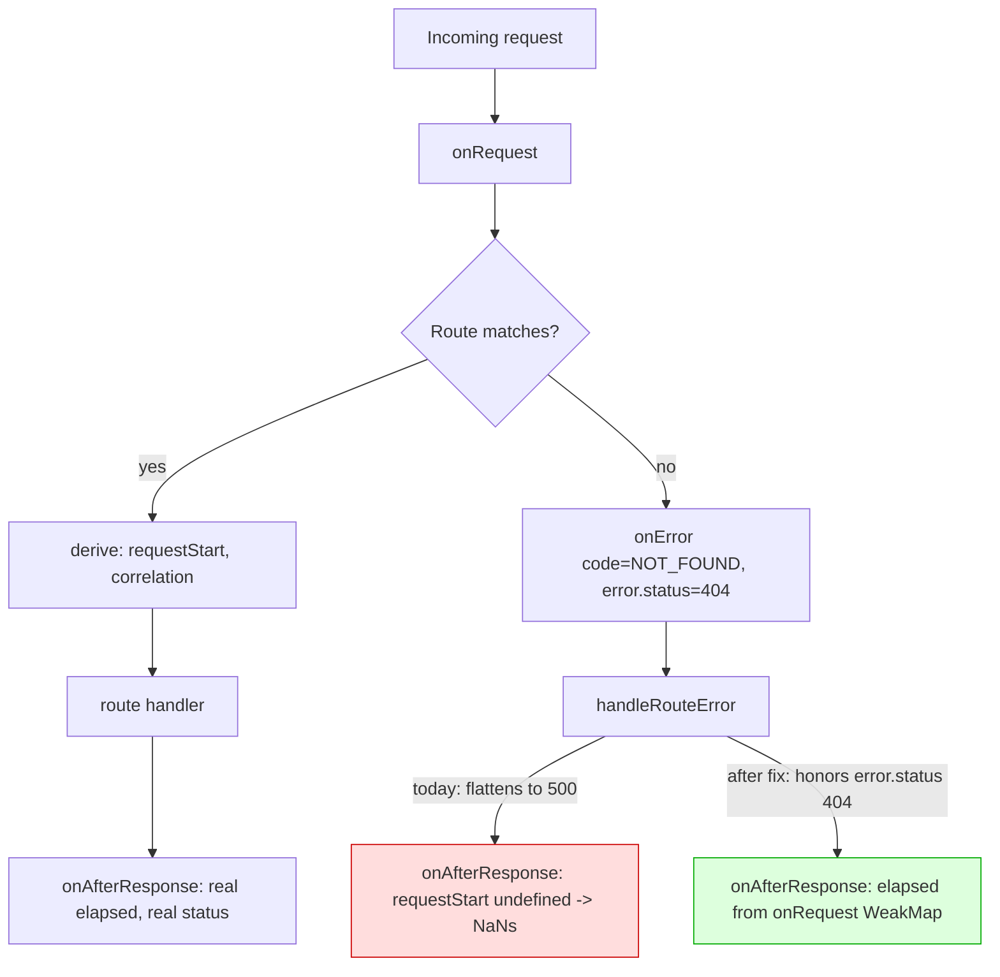

# fix: honor real error statuses on unmatched routes and stop forcing tool strict mode

## Summary

Two independent defects observed in production use of ghc-proxy v0.9.1, both
reproduced locally and both measured against real upstream before this plan was
written.

**Defect A** — every request that does not match a registered route returns
`500` and logs the literal string `NaNs` as its duration. The real status
(`404`, `400`) is discarded and the elapsed-time computation reads an undefined
start timestamp.

**Defect B** — the `/responses` route forces `strict: true` on every function
tool the caller did not explicitly mark, which makes upstream enforce schema
rules ordinary client schemas do not satisfy, producing a 400 the client cannot
work around. A companion schema-rewrite block silently promotes optional
parameters to required.

Both fixes are deletions or narrowings of proxy-side behavior that was asserting
something upstream never asked for.

---

## Problem Frame

### Defect A: unmatched routes report 500 NaNs

Observed (user's log, v0.9.1):

```
<- GET /api/v1/models 500 NaNs
<- GET /api/tags 500 NaNs
<- GET /v1/props 500 NaNs
<- GET /props 500 NaNs
<- GET /version 500 NaNs
<- GET /v1/models/gpt-5.6-sol 500 NaNs
<- POST /api/show 500 NaNs
<- GET /v1/models 200 1ms rid=8ef88f07
```

`GET /v1/models` returning `200` in the same run rules out an outage. Every
`500 NaNs` line is a path with no registered route — a client (Ollama-shaped,
llama.cpp-shaped) probing endpoints this proxy does not implement.

Reproduced locally against elysia 1.4.28 by wiring the real `handleRouteError`
into a bare Elysia app. The probe printed
`final status 500 {"error":{"message":"NOT_FOUND",...}}` and
`afterResponse requestStart= undefined => elapsed NaN` — byte-for-byte the
reported symptom.

Two independent causes, both live:

1. **Status flattening.** `handleRouteError` (`src/server.ts:35-65`) returns
   early only for `code === 'HTTP'` and timeout-like errors. Everything else
   falls to a hardcoded `set.status = 500`. Elysia's own error classes carry an
   accurate `status` that is thrown away. Measured:

   | Elysia `code` | Error class | `error.status` | Currently returned |
   | --- | --- | --- | --- |
   | `NOT_FOUND` | `NotFoundError` | 404 | 500 |
   | `PARSE` | `ParseError` | 400 | 500 |
   | `VALIDATION` | `ValidationError` | 422 | 500 (not reachable — see R2) |
   | `UNKNOWN` | plain `Error` | `undefined` | 500 (correct) |
   | `UNKNOWN` | `TranslationFailure` | 400 \| 502 | 500 (see R3) |

   `status` is a declared public property on every Elysia built-in error class
   (`InternalServerError`, `NotFoundError`, `ParseError`, `ValidationError`), so
   this is a class contract rather than an implementation detail. Verified at the
   installed 1.4.x; phrased against the contract deliberately, since a line
   range in a lockfile-managed path does not survive a dependency bump.

2. **Undefined start timestamp.** `requestStart` is set in `.derive()`
   (`src/server.ts:76-79`). A hook probe measured which lifecycle hooks fire per
   path:

   ```
   /health    → onRequest, derive, afterResponse(requestStart=set)
   /api/tags  → onRequest, onError, afterResponse(requestStart=undefined)
   ```

   `derive` is skipped entirely on an unmatched route, so `formatElapsed`
   (`src/lib/request-logger.ts:145-147`) computes `Date.now() - undefined` =
   `NaN`, which `formatDurationMs` (`src/util/duration.ts:6`) renders as `NaNs`.

   `onRequest` **does** fire on every path including unmatched ones — verified
   in the same probe. A `WeakMap<Request, number>` populated in `onRequest`
   produced correct elapsed values on both the matched and unmatched path.

This is a proxy-boundary contract violation, not only a log cosmetic. Per
`AGENTS.md`, OpenAI-facing routes stay OpenAI-compatible at the proxy boundary —
an unknown path on an OpenAI-compatible surface is a `404`, and a malformed body
is a `400`. A blanket `500` tells every client the proxy is broken when the
request was simply not one it serves.

### Defect B: proxy forces strict mode onto caller tool schemas

Observed (user's log, v0.9.1):

```
Invalid schema for function 'mcp__CherryHub__invoke': In context=(), 'required'
is required to be supplied and to be an array including every key in properties.
Extra required key 'params' supplied.
<- POST /v1/responses 400 431ms model=gpt-5.6-terra
```

`src/routes/responses/handler.ts:136` writes `strict: tool.strict ?? true`. The
client sent no `strict`; the proxy turned it on. Under strict mode upstream
enforces a schema contract ordinary client schemas — MCP servers, plugin
manifests, JSON Schema with composition — do not satisfy.

**Live probe evidence.** All 10 advertised `/responses` models, real Copilot
upstream, run 2026-08-06. Run as scratch scripts; **U0 lands them as standing
cases in `scripts/probes/`** so this table is re-runnable rather than
transcribed.

| Schema shape | `strict` omitted | `strict: false` | `strict: true` |
| --- | --- | --- | --- |
| Raw client MCP schema (`$schema`/`$id`/`title`/`format`/`examples`/`default`/`deprecated`/`contentEncoding`, `$ref`+`$defs`, `anyOf` sub-schema, partial `required`, `additionalProperties: true`) | 200 on 10/10 | 200 on 10/10 | — |
| `required` naming a key absent from `properties` | 200 | **400** `schema must have type 'object' and not have 'oneOf'/'anyOf'/...` | 400 (the reported error) |
| Partial `required` (a genuinely optional property) | 200 | 200 | 400 `'additionalProperties' is required to be supplied and to be false` |
| `$ref` at schema root beside a sibling `required` | 200 (400 only on `grok-4.5`: `root schema is a $ref`) | 200 | 400 |

A **functional** probe — `tool_choice` forcing the call, prompt requiring it —
confirms the tool is actually invoked with `strict` omitted, not merely that the
schema is accepted:

```
gpt-5.6-terra  strict=undefined  200  CALLED args={"city":"Paris","units":"c"}
gpt-5.3-codex  strict=undefined  200  CALLED args={"city":"Paris","units":"c"}
grok-4.5       strict=undefined  200  CALLED args={"city":"Paris"}
```

Per `CONCEPTS.md` ([[Upstream probe]]), a functional check needs a prompt the
tool is necessary for; this one has it, and the optional `units` parameter comes
back populated on two of three models — proving the optional-parameter semantics
survive.

**Omission beats `strict: false`.** The extra-required case returns 200 with
`strict` absent and 400 with `strict: false` — reproduced twice per model on two
models. The two values are not interchangeable: upstream applies a *different*
validator when the key is present at all.

Three consequences follow:

1. `src/routes/responses/handler.ts:136` forces `strict` on the OpenAI-facing
   `/responses` route.
2. `src/translator/responses/anthropic-to-responses.ts:252` hardcodes
   `strict: false` on the Anthropic→Responses path — measurably worse than
   omission for one schema class.
3. `src/translator/responses/function-schema.ts:53-58` rewrites
   `normalized.required = Object.keys(normalized.properties)` and
   `normalized.additionalProperties = false` on every object node. That block
   exists only to satisfy strict mode. With strict no longer forced it is not
   merely unnecessary — it is a **silent semantic rewrite**: a client's optional
   parameter becomes required, and a schema that accepted extra keys stops
   accepting them. Per `AGENTS.md`, a translator must not silently change a
   caller-visible field; per `CONCEPTS.md` ([[Translation policy]]), an
   incompatibility is never resolved by silently altering request semantics.

   It also cannot reach the reported failure: when `required` sits at a
   composition root beside `$ref`/`anyOf` with no sibling `properties`, the
   block does not fire. Verified by running the normalizer over five schema
   shapes — the `$ref`-root and `anyOf`-root cases passed through with their
   `required` untouched. That is precisely why the CherryHub schema slipped
   through the normalizer and hit upstream's strict validator.

---

## Requirements

**R1.** An unmatched route returns and logs `404`, not `500`.

**R2.** A malformed request body returns and logs `400`. A schema-validation
failure returns and logs `422` — reachable only at the exported
`handleRouteError` seam today, since no route in `src/routes/*/route.ts`
declares an Elysia/TypeBox body schema (every handler takes raw `body` and
validates with Zod inside ingest, which throws `HTTPError(400)`). KTD1's generic
status read covers it for free the day a validator is added; see U1's test
scenarios for how it is exercised.

**R3.** A thrown error carrying no plausible status still returns `500`. An
error that carries its own plausible HTTP status now surfaces that status
regardless of Elysia's `code` — this is broader than Elysia's own error classes.
The one in-repo instance is `TranslationFailure`
(`src/translator/anthropic/translation-issue.ts:10`, `status: 400 | 502`), which
reaches `onError` as `code: 'UNKNOWN'` on the response-direction path because
`fromCapiResponse` (`src/routes/messages/strategies/chat-completions.ts:39`) is
not wrapped by `withTranslationErrors`. Verified directly: today it maps to 500;
under KTD1 it returns 502. That is the more correct status, and it is a
deliberate, tested change rather than a side effect.

**R4.** The existing `504` timeout mapping and the `code === 'HTTP'` passthrough
are preserved byte-for-byte.

**R5.** The access log shows a real elapsed duration on every path, including
paths where `derive` never runs. `NaNs` cannot appear.

**R6.** `/responses` forwards the caller's `strict` when they sent one and omits
the key entirely when they did not.

**R7.** The Anthropic→Responses path omits `strict` rather than sending `false`.

**R8.** The proxy does not rewrite a caller's `required` array or inject
`additionalProperties: false`. A tool declared with two properties and one
required key reaches upstream with exactly one required key.

**R9.** Metadata-annotation stripping (`COPILOT_UNSUPPORTED_SCHEMA_ANNOTATIONS`)
is preserved unchanged.

---

## Key Technical Decisions

### KTD1. Read `status` off the thrown error rather than mapping Elysia codes

Elysia's error classes each declare a `status: number` property. Branching on
`code === 'NOT_FOUND' | 'PARSE' | 'VALIDATION'` would restate a mapping the
error object already carries, and would go stale the moment Elysia adds a code.
Read the property; fall back to `500` when it is absent or not a plausible HTTP
status.

Guard the read: `error` is typed `unknown` in the handler signature, and a
thrown non-Error value must not produce `set.status = undefined`. Accept only a
number in the 400-599 range; anything else falls through to `500`.

Rationale: this is the same discipline as `CONCEPTS.md` [[Advertised
capability]] — prefer what the object states about itself over a hardcoded list
the proxy maintains, because the former extends to cases that did not exist when
the code was written.

### KTD2. Move request-start capture to `onRequest`, keyed by a WeakMap

`derive` does not run on unmatched routes; `onRequest` does. Measured directly
on **Bun 1.3.14 and Node 24.18 via `@elysiajs/node`** — both runtimes fire
`onRequest` on unmatched paths and both preserve `Request` object identity
through to `onAfterResponse`, so the WeakMap key survives. `AGENTS.md` commits
`src/` to both runtimes and the test suite runs only under Bun, so naming the
runtime here is the discipline
`docs/solutions/testing/green-suite-is-evidence-about-one-runtime.md` asks for.

`src/lib/request-logger.ts` already owns exactly this pattern for request
correlation — `requestCorrelation` is a `WeakMap<Request, RequestCorrelation>`
with a `getOrCreate` accessor, GC'd when the Request is collected. Extending
that module with a start-timestamp WeakMap follows the file's own established
idiom rather than introducing a second mechanism.

Alternative rejected: defaulting `formatElapsed(undefined)` to `0ms`. That hides
the missing timestamp behind a plausible-looking number and would report `0ms`
for a request that took a second. Capturing a real start is the same size of
change and produces a true value.

**Belt-and-braces:** `formatElapsed` still guards against a non-finite input and
renders `-` rather than `NaNs`. The elapsed formatter is shared, and any future
hook-skipping path would otherwise reproduce the defect. R5 is satisfied at the
source (KTD2) and defended at the formatter.

### KTD3. Omit `strict` rather than send `false`

*(session-settled: user-directed — chosen over sending `strict: false`
explicitly: the extra-required schema class returns 200 with the key absent and
400 with `strict: false`, reproduced twice per model on two models. Upstream
runs a different validator when the key is present at all.)*

Governs R6, R7.

### KTD4. Delete the `required`/`additionalProperties` rewrite; keep metadata stripping

*(session-settled: user-directed — chosen over deleting `function-schema.ts`
wholesale, and over leaving the rewrite in place: the rewrite is a silent
semantic change that only strict mode ever needed, while the metadata-stripping
block was added 2026-04 against the upstream of the day and "not needed today"
is not "never needed".)*

Governs R8, R9.

Probes show upstream now accepts `$schema`/`title`/`format`/`examples` on all 10
models with `strict` omitted, so the stripping block is currently inert. It stays
anyway: deleting it is maximum risk for minimum gain, and per
`docs/solutions/conventions/upstream-types-are-not-contract-evidence.md` a probe
result is a dated snapshot, not a permanent fact.

The rewrite block is different in kind. It is not inert — it actively changes
what the caller asked for, on every request, on both the OpenAI-facing and
Anthropic-facing paths.

---

## High-Level Technical Design

Defect A, the two failure paths through the Elysia lifecycle:



Defect B, where `strict` is written on each path:

```mermaid
flowchart LR
    subgraph OpenAI-facing
      C1[Client POST /v1/responses] --> H[routes/responses/handler.ts<br/>applyFunctionToolCompatibilityDefaults]
    end
    subgraph Anthropic-facing
      C2[Client POST /v1/messages] --> T[translator/responses/anthropic-to-responses.ts<br/>convertAnthropicTools]
    end
    H --> N[translator/responses/function-schema.ts<br/>normalizeFunctionParametersSchemaForCopilot]
    T --> N
    N --> U[Copilot /responses]

    H -.today: strict = tool.strict ?? true.-> U
    T -.today: strict = false.-> U
    N -.today: rewrites required + additionalProperties.-> U
```

The normalizer is shared by both paths, so the R8 change lands once and fixes
both. The `strict` writes are per-path and need two edits.

---

## Implementation Units

### U0. Land the strict-mode matrix as standing probe cases

**Goal:** the Defect B evidence is re-runnable by anyone, not transcribed from
deleted scratch scripts.

**Requirements:** none directly — this is
`docs/solutions/conventions/capability-verdicts-are-scoped-to-one-boundary.md`
§4: "A finding that does not land in the standing probe is a finding with a
one-run shelf life."

**Dependencies:** none. **Blocks U4** — the deletion should not land before its
justification is reproducible.

U3 is deliberately *not* gated on U0 even though it rests on the same matrix.
U3 stops the proxy writing a value the caller never sent; if its evidence later
proves wrong, the remedy is to start sending `strict` again, and no client
payload was altered in the meantime. U4 deletes a rewrite that is actively
holding schemas together for `strict: true` callers, with a disclosed 200→400
regression — that one should not outlive its evidence.

**Files:**
- `scripts/probes/tool-strict.ts` — new
- `src/translator/responses/function-schema.ts` — cite the probe + date in the
  doc comment (done in U4; noted here so the two stay paired)

**Approach:**

1. Model the matrix the way the existing probes do: schema shape × `strict`
   value (`omitted` / `false` / `true`), across the models
   `pickResponsesModels()` returns. Use `probeResponsesEndpoint` and the
   `unmeasured` handling from `scripts/lib/probe-harness.ts` — a 503 is a
   capacity blip, not a capability verdict.
2. Cover the four shapes the scratch run used: raw client MCP schema
   (metadata + `$ref`/`$defs` + `anyOf` + partial `required` +
   `additionalProperties: true`), `required` naming a key absent from
   `properties`, partial `required`, and `$ref`-at-root.
3. Include the **functional** case — `tool_choice` forcing the call with a
   prompt that requires it — so the probe distinguishes "schema accepted" from
   "tool actually runs". Per `CONCEPTS.md` [[Upstream probe]], a functional check
   whose prompt could be satisfied without the tool proves nothing.
4. `ToolCase` in `scripts/lib/tool-cases.ts` models declaration + functional
   invocation *per tool*, not a shape × strict-value matrix. Widen it or write a
   sibling probe — the implementer's call; do not force a bad reuse.

**Test expectation:** none — `scripts/` is probe tooling, not shipped route code,
and it burns real quota. It is exercised by running it, not by the suite.

**Verification:** `bun scripts/probes/tool-strict.ts` reproduces the four-row
matrix in Problem Frame, including the omission-vs-`false` asymmetry.

---

### U1. Honor the thrown error's own status in `handleRouteError`

**Goal:** an unmatched route returns 404, a parse failure 400, and any error
carrying its own plausible status surfaces that status; errors carrying none
still return 500.

**Requirements:** R1, R2, R3, R4. Implements KTD1.

**Dependencies:** none.

**Files:**
- `src/server.ts` — modify `handleRouteError`
- `tests/reliability.test.ts` — extend the existing error-mapping and
  access-log describes

**Approach:**

1. In `handleRouteError`, after the existing `code === 'HTTP'` early return and
   the `isTimeoutLikeError` 504 branch, read a status off the thrown error
   before falling back to 500.
2. Extract the status through a narrow guard: the value must be a number in the
   400-599 range. Anything else — absent, non-numeric, out of range — resolves
   to 500.
3. Keep writing `set.status` on every branch. The existing comment on
   `handleRouteError` explains why (`onAfterResponse` reads `set.status`, and
   `onError` returns a fresh `Response` rather than falling through); that
   invariant is unchanged and the comment should be extended, not replaced.
4. The response body shape stays as it is — `{ error: { message, type: 'error' } }`
   — so no client-visible body contract changes. Only the status changes.

**Patterns to follow:** the existing early-return structure in
`handleRouteError`; the `isTimeoutLikeError` branch is the model for "recognize
a class of error, set a specific status, return a matching `Response.json`".

**Test scenarios:**
- `GET` on an unregistered path (`/api/tags`) through the real `createServer()`
  returns 404 and the response body is JSON.
- `POST /v1/messages` with a syntactically invalid JSON body returns 400.
  Reachable through `createServer()` — `PARSE` fires on malformed JSON without
  any route schema.
- A constructed `ValidationError` returns 422. **Exercise this by calling the
  exported `handleRouteError` directly**, the same way the two guard-band
  scenarios below do — no route in this repo declares a body schema, so no live
  request can produce one. `ValidationError` is exported from `elysia` and
  constructible (verified). This is one code path with the 404/400 cases under
  KTD1's generic read, not a separate branch, so it needs no separate mutation
  check.
- A thrown plain `Error` from a route handler still returns 500 with
  `{ error: { message: '<msg>', type: 'error' } }` — the existing
  `Generic Error returns 500` test must keep passing unchanged.
- A thrown `HTTPError(429, ...)` still surfaces 429 via `toResponse()` — the
  existing test must keep passing unchanged.
- A Bun-shaped timeout still returns 504 with the timeout body — the existing
  test must keep passing unchanged.
- A thrown non-Error value (e.g. `throw 'boom'`) returns 500, not `undefined`
  status. This is the guard-band case; `error` is typed `unknown`.
- A thrown object carrying an out-of-range `status` (e.g. `{ status: 200 }` or
  `{ status: 99 }`) returns 500, not the bogus value. An error must never
  produce a 2xx.
- An unwrapped `TranslationFailure` with `status: 502` returns 502, not 500.
  This is the R3 blast-radius case — the status read is deliberately
  class-agnostic, so any in-repo error carrying a plausible status is covered.
  Verified directly against the current tree.

**Verification:** unmatched paths return 404 through `createServer()`; every
pre-existing status-mapping test in `tests/reliability.test.ts` still passes.

---

### U2. Capture request start in `onRequest` so elapsed is real on every path

**Goal:** the access log shows a true duration on unmatched routes; `NaNs`
cannot be produced.

**Requirements:** R5. Implements KTD2.

**Dependencies:** none (independent of U1; both touch `src/server.ts` but
different hooks).

**Files:**
- `src/lib/request-logger.ts` — add the start-timestamp WeakMap + accessor;
  harden `formatElapsed`
- `src/server.ts` — populate the WeakMap in `onRequest`; read it in
  `onAfterResponse`
- `tests/reliability.test.ts` — extend the access-log describe

**Approach:**

1. Add a `WeakMap<Request, number>` to `src/lib/request-logger.ts` alongside the
   existing `requestCorrelation` WeakMap, with a `markRequestStart(request)`
   setter and a getter. Mirror the existing module's naming and export style.

   **Declare the setter `: void` explicitly.** `WeakMap.prototype.set` returns
   the WeakMap, and Elysia turns any non-undefined `onRequest` return into the
   response — see step 2.
2. Wire `.onRequest(({ request }) => { markRequestStart(request) })` into
   `createServer()`, with a **block body**. `onRequest` fires on every path —
   measured.

   **This is a live footgun, not a style note.** Elysia's `createOnRequestHandler`
   does `re = mapEarlyResponse(onRequest[i](c), c.set); if (re !== undefined) return re`.
   Measured against elysia 1.4.28: a setter written as a concise arrow over
   `.set()` returns the WeakMap, and **every response in the proxy becomes the
   string `"[object WeakMap]"`** with status 200. Confirmed by probe:

   ```
   leaky helper + concise hook    200 "[object WeakMap]"
   leaky helper + block hook      200 {"ok":true}
   safe helper  + concise hook    200 {"ok":true}
   inline .set  concise           200 "[object WeakMap]"
   ```

   `tsc` does not catch it. The block body and the `: void` return type are
   independent defenses; take both.
3. `onAfterResponse` reads the stored start instead of the derived
   `requestStart`. **Remove `requestStart` from `.derive()`** — it has exactly
   three references in the repo (the `derive` assignment and the two
   `onAfterResponse` lines), so nothing else consumes it. Do not remove the
   `...getOrCreateRequestCorrelation(request)` spread, which `onBeforeHandle`
   and `onAfterResponse` both use.
4. Harden `formatElapsed` to render `-` when the start is missing or the
   computed duration is not finite. This is the shared-formatter defense; it must
   not be the only fix (R5 is satisfied by step 2).

**Patterns to follow:** `requestCorrelation` / `getOrCreateRequestCorrelation`
in the same file — same WeakMap-keyed-on-Request shape, same GC story, same
placement.

**Test scenarios:**
- **A matched route returns its real body** — `GET /health` through
  `createServer()` returns the health JSON, not `"[object WeakMap]"`. This is
  the guard for the step-2 footgun; no existing test asserts a body on a matched
  route through the real server, which is why the defect would otherwise ship
  green.
- An unmatched path logs a duration matching `/^\d+(ms|s)$/` — specifically not
  containing `NaN`. Assert on the logged line captured through the
  `captureAccessLogLine` helper (see refactor note below).
- A matched path (`/health`) still logs a real duration — no regression.
- `formatElapsed(undefined)` returns `-`, not `NaNs`. Direct unit assertion on
  the exported function, so the formatter defense is covered independently of
  the server wiring.
- `formatElapsed` with a valid start still formats `ms` under a second and `s`
  above it — the existing `formatDurationMs` contract is unchanged.

**Helper refactor note.** `captureAccessLogLine` (`tests/reliability.test.ts`)
is not URL-parameterized today: its argument is a `reject` function assigned to
`CopilotClient.prototype.createChatCompletions`, and it hardcodes `POST`, a JSON
content-type, and a body. An unmatched-route scenario makes no upstream call, so
this is a small refactor — take a `Request` (or `{ url, method, body }`) and make
the `reject` stub optional — not a parameter addition. The four existing call
sites keep working via defaults.

**Verification:** the captured access-log line for an unmatched route contains a
numeric duration and a `404` status; no line in a full `bun test` run contains
`NaNs`.

---

### U3. Stop forcing `strict` on both Responses-bound tool paths

**Goal:** the caller's `strict` is forwarded when present and the key is absent
when they did not send one — on both the OpenAI-facing route and the
Anthropic→Responses translator.

**Requirements:** R6, R7. Implements KTD3.

**Dependencies:** none.

**Files:**
- `src/routes/responses/handler.ts` — `applyFunctionToolCompatibilityDefaults`
- `src/translator/responses/anthropic-to-responses.ts` — `convertAnthropicTools`
- `tests/responses-routing.test.ts` — update the strict assertions
- `tests/anthropic-translation.test.ts` — update the strict assertions

**Approach:**

1. In `applyFunctionToolCompatibilityDefaults`, replace `strict: tool.strict ?? true`
   with a conditional spread so the key is omitted when the caller sent nothing.
   `strict: false` sent by the caller must still be forwarded as `false` — only
   *absence* maps to absence.

   **Gate the spread on `tool.strict != null`, not `!== undefined`.**
   `ResponseFunctionTool.strict` is typed `boolean | null`
   (`src/types/responses.ts:105`), so an explicit `null` is representable. Since
   KTD3's whole finding is that upstream runs a *different validator* when the
   key is present at all, forwarding `strict: null` is the exact failure this
   unit exists to prevent. Both `undefined` and `null` map to omission.
2. In `convertAnthropicTools`, drop the hardcoded `strict: false`. Anthropic's
   tool schema has no `strict` concept, so there is nothing to forward — the key
   is simply not written.
3. Leave `applyFunctionApplyPatch` alone. Its synthesized `apply_patch` tool sets
   `strict: false` on a schema the proxy itself authored (`{ input: string }`,
   fully required, no composition), so the value is deliberate and the schema
   satisfies it. Out of scope per scope discipline.

**No third writer exists.** Grep for `strict:` across `src/` (excluding types and
ingest validation) returns exactly four sites: the two this unit changes,
`handler.ts:170` (the `apply_patch` tool above), and
`anthropic-to-responses.ts:306` — which is `text.format.strict`, a structured-output
field, not a tool field. The Chat Completions path writes no tool `strict` at all.

**Patterns to follow:** `anthropic-to-responses.ts:306` already uses the exact
idiom this unit adopts —
`...(format.strict !== undefined ? { strict: format.strict } : {})`. Mirror it
(with the `!= null` widening from step 1) rather than inventing a shape.

**Test scenarios:**
- A caller-declared function tool with no `strict` key reaches upstream with no
  `strict` key. Assert key absence explicitly (`expect('strict' in tool).toBe(false)`
  or `toEqual` on the whole object) — `toMatchObject` cannot distinguish
  "absent" from "not asserted", which is the exact distinction this unit exists
  to establish.
- A caller-declared tool with `strict: true` reaches upstream with `strict: true`.
- **A caller-declared tool with `strict: true` and a partial `required` array
  reaches upstream unmodified** — and upstream returns 400. This is the
  disclosed regression in Risks; the test asserts the payload crosses the
  boundary intact, not that the request succeeds. The proxy no longer opts the
  caller out of the mode they chose.
- A caller-declared tool with `strict: false` reaches upstream with
  `strict: false` — the value is forwarded, not swallowed as falsy.
- An Anthropic `/v1/messages` request routed through Responses Translation emits
  tools with no `strict` key.
- The synthesized `apply_patch` tool still carries `strict: false` — the
  existing test at `tests/responses-routing.test.ts:171` must keep passing
  unchanged.

**Verification:** `tests/responses-routing.test.ts` and
`tests/anthropic-translation.test.ts` pass with assertions rewritten to the new
contract.

---

### U4. Stop rewriting `required` and `additionalProperties` in the shared normalizer

**Goal:** a caller's tool schema crosses the proxy boundary with its
required/optional distinction intact.

**Requirements:** R8, R9. Implements KTD4.

**Dependencies:** U3, **U0**. Removing the rewrite while `strict: true` is still
forced would produce upstream 400s on schemas that currently pass — the rewrite
is what makes forced strict survivable. And the deletion should not land before
U0 makes its justification reproducible.

**Files:**
- `src/translator/responses/function-schema.ts` — remove the
  `required`/`additionalProperties` block
- `tests/responses-stream-translator.test.ts` — update the normalizer unit test
  (currently at line ~1005)
- `tests/responses-routing.test.ts` — update the route-level schema assertions.
  Note the test at line 422 is *named*
  `'/v1/responses adds additionalProperties false and derives required for nested object tool schemas'`
  — its title asserts the deleted behavior, so it needs renaming, not just an
  assertion edit. Same for line 230's `'normalizes function parameter required arrays'`.
- `tests/anthropic-translation.test.ts` — update the translator-level schema
  assertions. **Three** `toEqual` blocks (lines 509, 553, 595) carry the
  injected `required` array plus `additionalProperties: false`, with four
  `additionalProperties` occurrences total (one block nests two).
- `tests/messages-routing.test.ts` — also carries an `additionalProperties: false`
  assertion. Verified by grep: 14 `additionalProperties` occurrences across four
  files (4 + 6 + 3 + 1).

**Approach:**

1. Delete the trailing `if (node.type === 'object' || isRecord(normalized.properties))`
   block that assigns `normalized.required` and `normalized.additionalProperties`.
   Keep everything above it: the `COPILOT_UNSUPPORTED_SCHEMA_ANNOTATIONS` filter,
   the recursive `properties` walk, the array branch, and the nullish
   passthrough.
2. Update the doc comment so the file states what it now does — strips
   upstream-incompatible metadata annotations — and does not imply schema shape
   enforcement. Carry the probe date and the boundary, per the repo's convention
   of date-stamping upstream facts.
3. The function signature, name, and both call sites are unchanged. This is a
   behavior narrowing inside one function.

**Test scenarios:**
- A schema with two properties and `required: ['command']` normalizes to the
  same `required: ['command']` — the optional property stays optional. This is
  the load-bearing assertion for R8.
- A schema with no `required` at all normalizes with no `required` key injected.
- A schema with `additionalProperties: true` keeps `true` — the proxy does not
  overwrite an explicit caller value.
- A schema with no `additionalProperties` gets none injected.
- Metadata annotations (`$schema`, `title`, `format`, `examples`, `default`,
  `deprecated`, `contentEncoding`) are still stripped at every nesting depth —
  R9 regression guard, asserted on the same nested fixture the current test uses.
- `description` is still preserved (it is not in the strip list and carries
  meaning the model uses).
- Nullish passthrough: `undefined` → `undefined`, `null` → `null` — existing
  assertions unchanged.
- Route-level: a `/v1/responses` request with a partially-required tool schema
  reaches upstream with that schema unmodified except for stripped annotations.

**Verification:** `bun test tests/responses-stream-translator.test.ts` passes
with the rewritten normalizer contract; the route-level and translator-level
schema assertions in the other two files reflect the caller's original
`required` array.

---

### U5. Record the strict-mode finding as research + a solutions entry

**Goal:** the measured strict-mode behavior and the omission-vs-`false`
distinction survive past this PR, with their boundary and their gaps stated.

**Requirements:** none directly — this is the `AGENTS.md` rule that an
architectural change updates the relevant doc in the same change.

**Dependencies:** U0, U3, U4.

**Files:**
- `docs/research/responses-tool-strict.md` — new; the dated measurement
- `docs/solutions/conventions/<new-entry>.md` — new; the lesson
- `docs/anthropic-translation-matrix.md` — check whether a tool-schema row needs
  amending

**Approach:**

**The research entry** carries the measurement, matching the shape every other
file in `docs/research/` uses: the four-row matrix, the functional-probe output,
the date, the boundary (`/responses`, all 10 advertised models), a pointer to
`scripts/probes/tool-strict.ts` from U0, and — required, 7 of the 10 existing
research files carry one and every probe-based file among them does — an
explicit **`## Not covered`** section naming:

- Real client bundles. Claude Code's 14 tools and Codex's 5 tools, catalogued in
  `docs/research/claude-5-tool-schemas.md`, were not sent. Per that file: "Single
  tool passes do not prove a real client's payload passes."
- The reported CherryHub payload itself, which was never captured — there is no
  `--dump-failed-payloads` dump directory on this machine (verified).
- Streaming requests. All probes were non-streaming.
- The **Anthropic→Responses direction**. Its schema population is MCP/Claude Code
  `input_schema` objects rather than Responses `parameters`, and it routes
  through the same normalizer U4 changes — but it was not probed.
- `$ref`-at-root on `grok-4.5`, which returned 400 (`root schema is a $ref`)
  under every `strict` value. Pre-existing, not introduced by this change, and
  not fixed by it.

**The conventions entry** carries the lesson and links to the research file
rather than restating the table. The finding is a distinct failure mode from the
**four** conventions already catalogued under the `upstream capability modeling`
module, and the entry should say so explicitly (each existing entry does this
for its siblings):

- `upstream-types-are-not-contract-evidence.md` — the belief was never verified.
  Here forcing `strict: true` was a *choice the proxy made*, not a belief about
  upstream at all.
- `capability-verdicts-are-scoped-to-one-boundary.md` — a verdict measured on
  one boundary enforced on another. Here the boundary was right.
- `policy-rejection-is-not-a-protocol-limit.md` — an org-policy rejection read
  as a protocol limit. Here there was no rejection to misread.
- `capability-verdicts-name-a-schema-and-a-mechanism.md` — **dated 2026-08-06
  and currently untracked in git**, i.e. written the same day as this plan and
  the nearest neighbour by far. It says a verdict is scoped to the request
  schema it was measured with, and that an upstream error naming a field path
  describes the payload rather than the capability. Reconcile against it before
  writing: this plan's `strict` matrix is *exactly* a schema-scoped verdict, and
  the CherryHub 400 is *exactly* an error naming a field path. The new entry may
  turn out to be an extension of that one rather than a fifth sibling — check
  first, do not assume a new file is warranted.

The new axis: **the proxy opted the caller into a stricter contract than they
asked for, then rewrote their payload to satisfy it.** Both halves are
invisible from the client side — the caller sees a 400 naming a `required` key
they never wrote (the proxy wrote it), or silently loses an optional parameter.

Include the omission-vs-`false` asymmetry as the sharpest generalizable point: a
mode toggle is not a boolean with a safe default. There are three states —
`true`, `false`, and absent — and upstream runs a different validator for each.
Also note the rewrite could not reach composition-root `required`, so it never
protected the case it existed for.

Also check `docs/anthropic-translation-matrix.md` — it has tool rows but none
currently describe schema normalization. Add a row only if one is genuinely
missing; do not pad.

**Test expectation:** none — documentation.

**Verification:** the research entry has a `## Not covered` section; the
conventions entry follows the frontmatter shape of the existing
`docs/solutions/conventions/` files (`title`, `date`, `category`, `module`,
`problem_type`, `component`, `severity`, `applies_when`, `tags`), links to the
research entry, and is cross-linked from at least one sibling entry.

---

## Scope Boundaries

### In scope

Defects A and B as framed, their regression tests, and the solutions entry.

### Deferred to Follow-Up Work

- The `403 Copilot access revoked` case surfaces as a raw stack trace rather
  than a readable message. Worth improving; not requested, not part of either
  defect. This is about *presentation* — the verdict itself is correct and is
  recorded as a non-bug in the table below.
- `applyFunctionApplyPatch`'s deliberate `strict: false` on a proxy-authored
  schema. Correct as written; touching it would widen the diff for no measured
  gain.

### Explicitly not bugs — do not "fix" these

Investigated and confirmed correct or external. Recorded so a later reader does
not reopen them:

| Reported line | Verdict |
| --- | --- |
| `prompt token count of 986282 exceeds the limit of 922000` | Client oversent context. The proxy forwarded upstream's verdict correctly. |
| Upstream `500 Internal Server Error` on `/responses` | Transient upstream fault. `UpstreamRequestQueue` already retries transient statuses (`src/lib/error.ts:46`). |
| `WARN Lowered max_tokens from 128000 to 64000 ... claude-opus-5` then `200` | `clampMessagesOutputTokens` (`src/transform/parameter-filter.ts:269-284`) working as designed and documented. |
| `403 ... Copilot access has been revoked` | GitHub-side entitlement change. Verified resolved — `bun run ./src/main.ts check-usage` reports an active enterprise plan. |
| Claude Code `UserPromptSubmit hook timed out after 5s` | Local Claude Code hook configuration. Unrelated to this repository. |

---

## Risks

**Removing the schema rewrite could expose schemas upstream rejects for other
reasons.** Mitigated by evidence: the raw-schema probe sent an intentionally
adversarial schema (metadata annotations, `$ref`/`$defs`, `anyOf`, partial
`required`, `additionalProperties: true`) to all 10 `/responses` models and got
200 on 10/10. The one 400 anywhere in the probe matrix was `grok-4.5` rejecting
a `$ref` *at the schema root* — a shape the current normalizer does not fix
either, so it is not a regression this change introduces.

**An explicit `strict: true` caller regresses — measured, and intended.** U3
forwards a caller's explicit `strict: true`, and U4 removes the rewrite that made
strict survivable. Probed against live upstream on three models:

```
gpt-5.3-codex    today=200  after=400   'additionalProperties' is required to be supplied and to be false
gpt-5.4-mini     today=200  after=400   (same)
gpt-5.4          today=200  after=400   (same)
```

A caller sending `strict: true` with a partial `required` array gets a 200 today
(because the proxy silently rewrote their schema) and a 400 after. This is the
honest outcome — the caller opted into strict and upstream enforces strict, where
before the proxy quietly changed their schema to satisfy a mode they chose — but
it is a real client-visible change on a path this plan touches, and it is
disclosed here rather than discovered in production. Callers who send no `strict`
(the overwhelming majority, and the reported defect) strictly improve.

**Evidence has a one-run shelf life unless it lands in the standing probe.** The
Defect B matrix came from scratch scripts that were deleted. Per
`docs/solutions/conventions/capability-verdicts-are-scoped-to-one-boundary.md`
§4 — "A finding that does not land in the standing probe is a finding with a
one-run shelf life" — this plan removes proxy-side protection whose only
justification is a run nobody can reproduce. See U0.

**The probe generalizes from author-designed schemas.** The four shapes sent were
invented for the probe. The reported CherryHub payload was never replayed (no
`--dump-failed-payloads` capture exists — verified, there is no dumps directory),
and the Claude Code 14-tool / Codex 5-tool bundles catalogued in
`docs/research/claude-5-tool-schemas.md` were not sent. The Anthropic→Responses
direction — whose schema population is MCP/Claude Code `input_schema` objects
rather than Responses `parameters` — was not probed at all, though it routes
through the same normalizer U4 changes.

**A regression test that never failed.** Per
`docs/solutions/testing/regression-test-must-fail-first.md`, run the stash check
per fix, not per branch — this change has four independent behavioral edits
(status honoring, start capture, strict omission, rewrite removal) and stashing
all of `src/` at once would let one covered edit mask three uncovered ones.
Delete each edit individually and confirm the matching test goes red.

---

## Verification Contract

Full gate, in CI order: `bun run lint:all && bun run typecheck && bun test && bun run build`.

Baseline on a clean tree before any change: **678 pass, 0 fail, 20 files**. The
count will rise; it must not fall, and no pre-existing test may be deleted to
make a new contract fit — the assertions listed in U3/U4 are *updated in place*
because the contract intentionally changed.

Per-fix mutation check (`git stash push <one file>` → test → `git stash pop`),
run four times, once per behavioral edit: status-honoring (U1), start-capture
(U2), strict omission (U3), rewrite removal (U4). Do **not** stash all of `src/`
at once — per
`docs/solutions/testing/regression-test-must-fail-first.md`, one covered edit
turning the suite red masks three uncovered siblings. U0 and U5 are excluded:
they add no shipped route behavior.

Note the 404/400/422 cases are **one code path** under KTD1's generic status
read, not three branches — they need one mutation check between them, not three.

---

## Definition of Done

- [ ] Unmatched route returns and logs 404; parse failure 400; a constructed
      `ValidationError` maps to 422 at the exported seam
- [ ] Unknown error still 500; timeout still 504; `HTTPError` passthrough intact
- [ ] No access-log line can render `NaNs`; unmatched routes show a real duration
- [ ] Strict-mode matrix landed as standing probe cases and cited from
      `function-schema.ts`
- [ ] `/responses` omits `strict` when the caller sent none (both `undefined`
      and `null`), forwards it when they did
- [ ] Anthropic→Responses omits `strict`
- [ ] A caller's `required` array and `additionalProperties` cross the boundary unmodified
- [ ] Metadata-annotation stripping still works at every nesting depth
- [ ] Each of the four behavioral edits independently verified to fail its test when reverted
- [ ] `bun run lint:all && bun run typecheck && bun test && bun run build` green
- [ ] `docs/research/responses-tool-strict.md` written with a `## Not covered` section
- [ ] Solutions entry written, linking the research entry, and cross-linked

---

## Sources & Research

- Local Elysia lifecycle probes (scratch, deleted — Defect A is reproduced by
  U1/U2's own tests, so these needed no standing home): hook-firing per matched
  vs unmatched path on Bun 1.3.14 and Node 24.18; `handleRouteError` behavior
  against real `NotFoundError` / `ParseError` / `ValidationError`; the
  `onRequest` return-value footgun documented in U2 step 2; `TranslationFailure`
  status mapping.
- Elysia built-in error classes declare `status: number` as a public class
  contract (verified at the installed 1.4.x).
- Live Copilot probes 2026-08-06: strict-mode acceptance matrix across all 10
  `/responses` models; omission-vs-`false` asymmetry reproduced twice per model
  on two models; functional `tool_choice`-forced call confirming invocation with
  optional parameters populated; the explicit-`strict: true` regression
  reproduced on three models. Run as scratch scripts — **U0 lands them as
  standing cases** so the matrix is re-runnable rather than transcribed.
- `docs/solutions/conventions/upstream-types-are-not-contract-evidence.md`
- `docs/solutions/conventions/capability-verdicts-are-scoped-to-one-boundary.md`
  — §4 is why U0 exists.
- `docs/solutions/testing/regression-test-must-fail-first.md`
- `docs/solutions/testing/green-suite-is-evidence-about-one-runtime.md` — why
  KTD2's lifecycle measurement names both runtimes.
- `docs/research/claude-5-tool-schemas.md` — the whole-bundle standard this
  plan's probe does not meet; named in U5's `## Not covered`.
- `CONCEPTS.md` — [[Proxy boundary]], [[Translation policy]], [[Upstream probe]]
