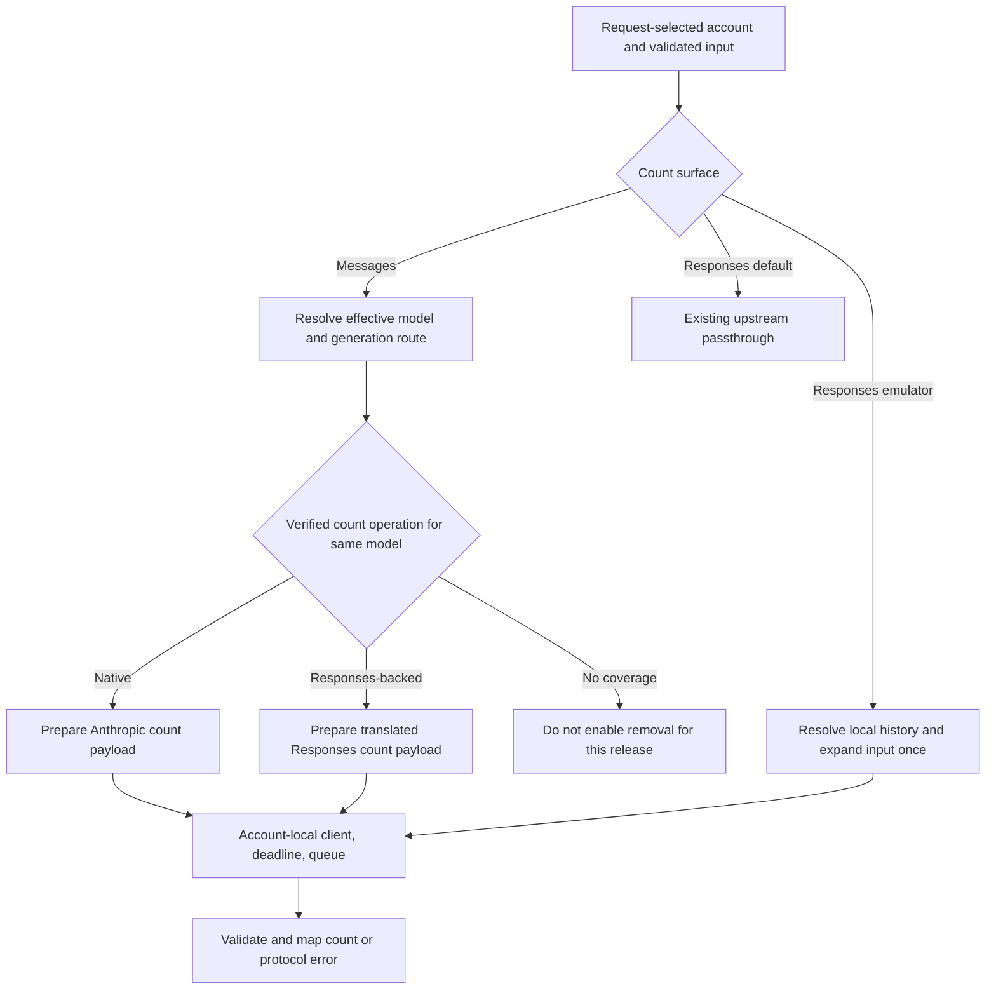
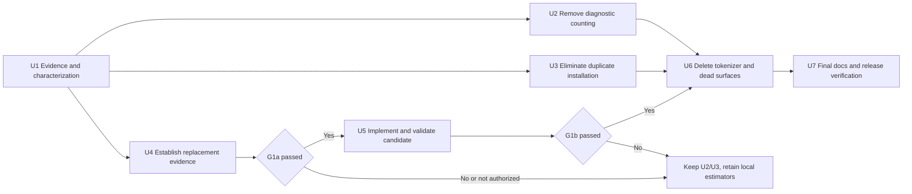

# Tokenizer Cost Reduction and Gated Removal - Plan

## Summary

Remove local token counting from Chat Completions generation and eliminate the redundant installed tokenizer package while preserving the existing count endpoints.
Then evaluate replacing local estimation with verified Copilot counting operations.
Remove the tokenizer implementation and bundled vocabulary tables only when that replacement passes the compatibility gate below.
If the gate fails or live validation is unavailable, deliver the independent improvements and leave full removal incomplete.

This is a staged implementation plan, not evidence that Copilot counting works.
The user authorized planning only; this document does not authorize product edits, live Copilot calls, commits, pushes, or releases.

---

## Goal Capsule

- **Objective:** Reduce installation overhead and avoidable request latency without unexpectedly disabling clients' preflight token counting.
- **Means:** Remove diagnostic BPE work, correct dependency packaging, and replace local counting only after verifying its upstream replacement.
- **Authority:** The user's instructions and repository compatibility contract govern this plan. Requirements own behavior; technical decisions own implementation choices.
- **Execution profile:** Start with offline characterization and isolated package checks. Keep production services running. Use account-local mocks and synthetic payloads.
- **Stop condition:** U1-U3 do not depend on G1. U2 and U3 each depend on U1 and may then proceed independently. U5 requires G1a; U6-U7 require both G1a and G1b. An unavailable or failed gate is a recorded blocker for full removal, not permission to invent a count, disable an endpoint, or declare removal complete.
- **Tail ownership:** The implementer owns integration and local validation. The user retains authority for live quota use and shipping.

---

## Product Contract

### Problem Frame

The current Chat Completions handler awaits a tokenizer solely to log an estimate before dispatching upstream.
The same dependency supplies two local preflight estimators and five packaged selfcheck probes.
Large vocabulary tables dominate the measured JS artifact, and the bundled dependency is also listed for installation at runtime.
The user wants to remove this cost, but replacing a working local endpoint with an unverified network operation could reduce client compatibility.

### Reassessment of the Previous Review

Baseline inspected on September 6, 2026: `main` at `466f4d7b467c5f21ed2ad1206cfe713a0d87d93f`, with a clean working tree before this plan was added.
This includes the multi-account work from PR #80; the prior investigation examined an earlier checkout while that work was still changing.

| Previous statement | Revised assessment | Planning consequence |
| --- | --- | --- |
| Tokenizer does not supply generation usage | Confirmed by the full tokenizer call-site inventory. Usage mapping consumes upstream counters. | Remove diagnostic counting without replacing usage reporting. |
| Every generation request pays tokenizer cost | Too broad. The direct Chat Completions handler pays it; Messages generation strategies and Responses generation do not call it. A separate client preflight can still incur it. | Benchmark endpoints separately. |
| Copilot exposes a usable Responses counting endpoint | The client exposes a forwarding method, not proof of service support. `docs/responses-upstream-notes.md` records 404 on March 11 and April 30, 2026. | Require fresh, scoped raw-upstream evidence. Neither old failure nor local method presence settles current support. |
| Current Claude Code falls back safely if counting fails | Embedded code showed a fallback, but its reachability in the user's normal flow was not demonstrated. | Require client behavior tests; do not use this claim to remove an endpoint. |
| PDF and thinking counts prove a universal accuracy defect | The PDF probe used synthetic non-PDF data. The placeholder path is confirmed, but numeric results are not real-PDF accuracy evidence. Thinking inclusion varies by protocol and target route. | Use valid assets and route-specific expectations. Do not blindly count all thinking or encrypted data as text. |
| First use adds about 100 MiB permanently | One isolated RSS delta was about 100 MiB. RSS includes allocator retention, transient allocations, JIT, and GC effects. | Measure fresh-process peak and post-GC memory separately. |
| Repeated input takes about 14 seconds | Observed for a synthetic 100k repeated-character case, with large run-to-run variation. It establishes a costly local path, not a production latency distribution. | Use bounded, repeated, isolated benchmarks with explicit cache state. |
| Five tokenizer encodings are all necessary | No current account/model inventory was checked to establish usage of the legacy encodings. | Full removal removes all five; selective pruning remains an alternative requiring inventory evidence. |
| Moving the dependency removes the bundle cost | Incorrect. Moving to devDependencies can avoid duplicate installation, but bundled vocabulary chunks remain. | Track package download, installed dependencies, bundle, sourcemaps, and runtime costs separately. |

Historical size observations from September 5: tokenizer `.mjs` chunks totaled 4,790,673 bytes out of 7,282,373 JS bytes; the installed tokenizer directory totaled 53,103,516 logical bytes.
The 77% compressed estimate was a sum of individually gzipped files, not a measured removal tarball.
These values are directional baselines only. Rebuild both comparison artifacts from controlled revisions before reporting savings.

### Requirements

#### Generation and Packaging

- R1. Chat Completions generation must not load a BPE vocabulary or count prompt tokens for diagnostic logging, including fallback attempts.
- R2. Generation payloads, model selection, output-token defaults, streaming, upstream usage, and existing authoritative request observations must retain their behavior.
- R3. An installed published artifact must not install `gpt-tokenizer` separately when the required implementation is already bundled; source development and builds must still resolve it until full removal.
- R4. Full removal must eliminate `gpt-tokenizer` from the manifest, lockfile, source import graph, installed dependency graph, and published runtime chunks.

#### Counting Compatibility

- R5. Preserve `/v1/messages/count_tokens` and both Responses input-token aliases. Preserve existing default Responses passthrough behavior and response schema.
- R6. A migrated counting path must count for the request-selected account and effective model. It must not switch account or substitute another model to obtain a count.
- R7. Preserve count-relevant system instructions, history, tools, and supported multimodal content through the selected path. Do not count transport encodings as model text or omit semantic fields to force acceptance.
- R8. Successful counts must be finite, nonnegative integers in the protocol's response shape. Upstream and malformed-response failures must remain explicit; never return synthetic 0 or 1 as a failure fallback.
- R9. Emulator counting must resolve local continuation history once, send the expanded input if using upstream, and leave local response/conversation state unchanged.
- R10. Count-only operations must not generate a completion, seed or mutate emulator state, trigger overload model fallback, or make hidden accuracy-check generation calls.

#### Runtime and Completion

- R11. New upstream counting must honor cancellation, a bounded deadline, account-local queue ownership, error mapping, and request correlation under both Bun and Node.
- R12. G1a must pass before U5 builds the replacement candidate; G1b must pass before U6 deletes the local implementations. U6/U7 verification must pass before shipping or declaring full removal complete; otherwise retain or restore the first-milestone behavior.
- R13. Keep non-tokenizer selfcheck probes and packaging coverage. Remove only tokenizer-specific probes when their implementation disappears.
- R14. No live Copilot probe runs without explicit authorization covering accounts, models, maximum requests, and any generation used for accuracy comparison.

### Acceptance Examples

- AE1. A Chat Completions request with a long repeated string reaches a mocked upstream without importing tokenizer encodings; the mock's usage is returned unchanged. Covers R1-R2.
- AE2. A native counting request with function tools and a valid image returns the upstream count without the old family multiplier or tool overhead being added again. Covers R6-R8.
- AE3. Identical model names on two hostnames use different account clients and model caches. An unknown hostname is rejected before counting. Covers R6, R11.
- AE4. An emulator continuation counts prior input, prior output, current input, current instructions, and current tools as applicable to the selected protocol. Another account's response ID cannot resolve. Covers R7, R9.
- AE5. A raw-upstream counting control returns 404 or lacks a needed content capability. G1 fails for that row, and the tokenizer remains available for it. Covers R12.
- AE6. A counting response contains a negative number, a string, a fractional value, or no count field. The migrated endpoint returns a protocol-shaped upstream-response error, not success. Covers R8.

### Scope Boundaries

The initial scope is U1-U3. Full removal is the conditional second milestone U4-U7.
Do not add an Anthropic API key, forward prompts to a new provider, replace BPE with another library, or create a provider plugin system in this change.
Do not add a `length / 4` fallback, new model allowlists without evidence, or broad changes to dependency declarations.
General ingress limits, worker pools, tokenizer-library tuning, Dashboard redesign, and Docker sourcemap stripping are separate follow-up work.

---

## Planning Contract

### Key Technical Decisions

- KTD1. Delete the diagnostic await in `src/routes/chat-completions/handler.ts`; do not move it after dispatch or hide only the log. Background synchronous BPE can still block the event loop. Governs R1-R2.
- KTD2. Move only `gpt-tokenizer` to devDependencies for the first milestone, subject to a clean install and bundled-runtime proof. Keep `deps.alwaysBundle` and the encoding chunks until G1 permits deletion. Governs R3.
- KTD3. Use explicit route-owned counting functions and the existing `CopilotClient`; do not create another strategy registry. Native and Responses counting selection must follow the effective generation route and separately verified counting support. Governs R5-R7.
- KTD4. Resolve Messages count model identity using ingest's `meta.betaHeaders`, `resolveRequestModel()`, and the selected account's model cache on a cloned payload. Select the corresponding route with `resolveMessagesStrategyName()`. Apply the Messages compact policy when it applies to the corresponding generation request, respecting beta exclusions; retain late CAPI family resolution on the Chat path. Count comparisons target the initially selected generation model, not an unpredictable later overload target. Emulator counting retains its requirement for an explicit resolvable `model`, including continuation requests; missing or empty model remains a local 400, with no inference from stored state. Default Responses passthrough keeps its optional-model forwarding behavior. Governs R5-R6.
- KTD5. Extract the native and Responses count-relevant preparation currently embedded in `strategy-registry.ts` into narrow pure helpers shared by generation and count handlers. Return change information needed by the existing generation effect logging, without emitting telemetry from preparation. Count payloads may omit `max_tokens`, so shared preparation must accept count inputs without adding a fake generation limit or dispatching generation. Project away generation-only parameters before calling a count endpoint. Governs R2, R7, R10.
- KTD6. New Messages and emulator upstream counts use a 10-second total deadline, or the configured upstream timeout when it is positive and shorter. Caller cancellation always wins. Reuse the existing account queue with retries disabled for these new preflights; do not alter the existing default Responses passthrough retry policy. The deadline includes queue wait and response-body consumption. Governs R11.
- KTD7. Validate count JSON after dispatch. For Messages, project only `input_tokens`; for emulator Responses, emit `object: response.input_tokens` and `input_tokens`. Preserve valid zero. Map malformed upstream JSON/counts to 502, cancellation through the existing abort lifecycle, and other upstream errors with their existing status and safe headers. The Messages count boundary must produce Anthropic `{ type: 'error', error: ... }` envelopes, following `handleMessagesCore()`; do not leak an OpenAI-shaped upstream body. Governs R5, R8, R11.
- KTD8. A verified upstream replacement reports that upstream's preflight estimate, not a guarantee of equality with final generation usage. Upstream outage/errors become visible once migrated; this loss of offline availability is a release acceptance item in G1. Governs R8, R12.
- KTD9. Do not implement a Chat-to-Responses counting conversion solely to make removal pass. A Chat-only target without a proven count operation blocks full removal; a new estimator or changed support policy needs a separate decision. Governs R6-R7, R12.

### G1: Replacement Compatibility Gates

U4 owns the evidence record at `docs/research/token-counting-replacement.md`.
Each matrix row identifies account class/tenant category without secrets, model ID, generation route, counting route, tested content classes, response validation, latency, and date.
Rows must cover native Messages models, Responses-backed Messages models, Chat-only models if advertised, Responses default mode, and Responses emulator mode.
Inventory all models currently advertised by the configured accounts. Grouping is allowed only when shared backend behavior is supported by evidence; one Claude success cannot cover unrelated providers or endpoint families.

G1 has two sequential parts. U4 records G1a before replacement implementation; U5 records G1b against its unshipped candidate. Full-removal activation requires both.

**G1a: Raw capability and client-policy evidence (before U5).**

1. The required counting operations exist on the raw Copilot endpoints for the supported rows. A local proxy response or a third-party README is insufficient.
2. Positive and negative controls show the returned count is responsive to input and valid in shape. Valid multimodal assets, tools, nonempty instructions, multi-turn history, and supported reasoning/compaction items are covered as applicable.
3. Current client workflows work with successful counting and expose predictable behavior for 400, 404, 429, 5xx, timeout, and cancellation. Test the installed Claude Code version's actual relevant workflows and a direct Anthropic SDK count caller. Do not infer client behavior from embedded strings alone.
4. No required raw capability row is unsupported or untested. The operator accepts the proposed network dependency, queue sharing, and error behavior; this is recorded separately from technical capability.

**G1b: Candidate correctness and operational evidence (after U5, before U6).**

1. Candidate count payloads agree with the corresponding generation preparation, including model rewrite and content handling. No count is obtained by silently weakening input or switching models/accounts.
2. Actual candidate preflight latency meets the verification target, including queue contention and body consumption. Account ownership, cancellation, and protocol error tests pass under both runtimes.
3. Client scenarios first exercised against controlled responses in G1a pass against the candidate. Unsupported and untested candidate rows are empty.

If either gate fails, preserve the first-milestone behavior in the shipping tree and report full removal blocked. U5 may wire the new paths in an isolated unshipped candidate after G1a; no new production feature flag or dual-backend framework is required just to stage this work.

G1a and G1b are currently **not passed**. No live requests were authorized or run during planning.
This is an execution/release prerequisite with a defined failure action; U1-U3 do not depend on it.

### Proposed Counting Flow After G1

The no-coverage branch is a release gate, not a new runtime response.
After activation, a newly unavailable backend produces its actual protocol-shaped error; it does not dynamically change counting models.

### Delivery and Dependencies

Package U2/U3 as independently reviewable changes. Keep U5/U6 coupled in the full-removal candidate to avoid publishing a half-migrated import graph.
The gate does not authorize a commit or release.

---

## Implementation Units

### U1. Establish Reproducible Baselines and Characterization

**Goal:** Separate historical observations from reproducible measurements and preserve generation contracts before editing.
**Requirements:** R1-R3, R5, R14; AE1.
**Dependencies:** None.
**Files:** New `scripts/benchmarks/tokenizer-cost.ts`, `tests/tokenizer-characterization.test.ts`, `docs/research/tokenizer-cost-baseline.md`; existing `tests/contract-smoke.test.ts`, `tests/pipeline-internals.test.ts`, `tests/parameter-filter.test.ts`, `tests/messages-routing.test.ts`, `tests/responses-emulator.test.ts`, `tests/helpers.ts`.
**Approach:** Inventory source callers and transitive imports. Benchmark clean baseline/candidate builds using one harness, one runtime version, serial runs, and matched payloads. Record artifact SHA, source SHA, environment, cache state, sample counts, CPU, peak RSS, post-GC memory, and timer/event-loop delay. Do not persist real prompts or secrets.
**Execution note:** Characterize routing and usage before changing their surrounding handler. Do not bless known inaccurate estimates as desired golden values.

**Test scenarios:**

1. Capture upstream payload and usage for Chat streaming and non-streaming, tool calls, image inputs, explicit/default output limits, and a fallback attempt.
2. Cover Messages count validation, mixed function/builtin tools, unresolved models, and special-token-looking text; distinguish existing behavior from desired accuracy.
3. Capture emulator continuation, tools/instructions, unknown IDs, expiry, and account-local state behavior.
4. Benchmark ordinary prose, Chinese, source code, JSON, unique tools, valid image data URLs, and repeated-character runs at bounded sizes. Use a subprocess timeout for pathological baselines.
5. Clear the library merge cache for cold-content comparisons. Alternate measured method order; do not compare cache-warmed `countTokens()` against uncached `encode()`.

**Verification:** Baseline evidence is reproducible offline. End-to-end HTTP measurements and helper-only measurements are reported separately.

### U2. Remove Chat Diagnostic Token Counting

**Goal:** Eliminate BPE work from direct Chat generation.
**Requirements:** R1-R2; AE1.
**Dependencies:** U1.
**Files:** `src/routes/chat-completions/handler.ts`, `tests/contract-smoke.test.ts`, `tests/pipeline-internals.test.ts`, `tests/parameter-filter.test.ts`; `docs/design/execution-strategy.md`, `docs/research/copilot-token-usage.md`.
**Approach:** Apply KTD1. Preserve max-token defaulting and renaming, payload logging outside this count, and pipeline fallback behavior. Update the docs that describe the removed hook behavior.

**Test scenarios:**

1. Covers AE1. An isolated process with tokenizer encoding imports made unavailable still completes direct Chat requests through a local upstream mock.
2. Streaming and non-streaming mock usage, including missing/cache counters, stay byte/field equivalent to the baseline contract.
3. Fallback, explicit limits, and model-specific `max_completion_tokens` behavior match characterization.

**Verification:** No tokenizer invocation or encoding load on the Chat path; paired benchmark improvement meets the first-milestone criteria.

### U3. Remove Redundant Runtime Installation

**Goal:** Avoid downloading/installing the separately bundled tokenizer dependency.
**Requirements:** R3, R13.
**Dependencies:** U1.
**Files:** `package.json`, `bun.lock`, `scripts/smoke/packaged-cli.ts`; dependency documentation only where it claims runtime installation is required.
**Approach:** Apply KTD2. Verify development builds still bundle the encodings after the dependency moves. Use the actual packed artifact in a clean install root outside the checkout, with repository `node_modules` unavailable to the runtime. Prefer cached/offline installs; preserve registry policy.

**Test scenarios:**

1. Normal dev install/build and frozen-lockfile validation succeed.
2. The installed artifact has no separate `gpt-tokenizer` package, but all five retained encoding probes succeed under Bun and Node.
3. `bunx`, `npx`, explicit CLI subcommands, and Docker runtime behavior remain valid; production-only source install is documented as insufficient for building.

**Verification:** Installed dependency savings are measured separately from the nearly unchanged tarball and JS chunk size. Do not move other dependencies in this unit.

### U4. Prove Counting Replacement Coverage

**Goal:** Produce G1a evidence and the fixture expectations that U5 will use to evaluate G1b.
**Requirements:** R5-R12, R14; AE2-AE6.
**Dependencies:** U1.
**Files:** New `scripts/probes/token-counting.ts`, `docs/research/token-counting-replacement.md`; reuse `scripts/lib/probe-harness.ts` and `scripts/matrix/live-compat-matrix.ts` patterns; valid small assets under `tests/fixtures/` when needed.
**Approach:** Build a dry-run/default-off probe with explicit request limits and selected-account scope. Probe raw upstream before drawing proxy conclusions. Use a local fake upstream for client error-path tests; do not launch normal client sessions against real credentials implicitly.

**Test scenarios:**

1. Inventory metadata without equating generation endpoint advertisement with counting support.
2. Test basic text, tools, changed instructions, valid images/PDFs, history, and applicable reasoning/compaction inputs against the candidate count operations.
3. Distinguish unsupported route/model, malformed input, auth errors, capacity errors, and timeout. A 400 field validation failure is not an endpoint absence verdict.
4. Exercise current Claude Code preflight/context workflows and direct SDK counting against controlled success and failure responses.
5. Verify unauthorized live mode sends no request. Record whether pricing/quota behavior is known; do not assume non-generative means quota-free.

**Verification:** Record G1a pass/fail with covered and untested rows; leave G1b pending for U5. If live execution is unauthorized or support is incomplete, stop the removal milestone here and report the precise gap.

### U5. Migrate Verified Count Paths

**Goal:** Replace the local estimators using the verified operation for the same account/model.
**Requirements:** R5-R11; AE2-AE4, AE6.
**Dependencies:** U4 with G1a passed.
**Files:** `src/clients/copilot-client.ts`, `src/routes/messages/count-tokens-handler.ts`, `src/routes/messages/route.ts`, `src/routes/messages/shared.ts`, `src/routes/messages/strategy-registry.ts`, new `src/routes/messages/request-preparation.ts`; `src/routes/responses/emulator.ts`, `src/routes/responses/resource-dispatcher.ts`, `src/routes/responses/resource-handler.ts`, `src/translator/responses/anthropic-to-responses.ts`; relevant `src/types/` and `src/ingest/validation/` definitions; `tests/messages-routing.test.ts`, `tests/responses-emulator.test.ts`, `tests/responses-routing.test.ts`, `tests/upstream-transport.test.ts`, `tests/account-routing-runtime.test.ts`, `tests/dashboard-recovery-correlation.test.ts`.
**Approach:** Apply KTD3-KTD8. Add the narrow Messages counting client operation and reuse Responses counting transport. Pass the request signal, correlation, and selected account through the new path. Extract emulator effective-input resolution without state writes, remove local-only continuation identifiers before dispatch, and include current count-relevant fields beyond `input`.

`createResponseInputTokens` currently forces `retryable: true`; extend its call options only enough for the new preflights to opt out, while preserving the default for existing callers. Pass the effective model into queue dispatch for the new counting paths so model cooldowns remain correctly scoped. Reject already-aborted callers before creating a signal or entering the queue; the existing signal helper alone does not handle that case. Catch malformed upstream JSON at the count boundary without converting cancellation, timeout, or existing HTTP errors into 502.

**Test scenarios:**

1. Covers AE2 and AE6. Map valid counts without calibration; reject malformed count bodies with 502 and keep valid zero.
2. Covers AE3. Two accounts with the same model names remain isolated under concurrent success, queue wait, cancellation, and errors.
3. Covers AE4. Previous response and conversation continuation expand exactly once. Current instructions/tools remain present. Missing, expired, deleted, and foreign-account IDs fail locally without upstream calls.
4. Matching create/count fixtures assert the exact count-relevant outbound payload for custom model rewrites, dash/dot aliases, family fallback, compact policy, structured output, toolsets, phase stripping, and enabled compaction/input policies. Omitted `max_tokens` remains valid; pure preparation does not record generation effects.
5. Test 400/401/403/404/429/5xx, malformed JSON, deadline while queued, stalled response body, and caller disconnect. Assert the complete protocol-specific error envelope and safe headers, preserve status, and release queue leases exactly once.
6. Counting never calls a generation method, changes emulator state, uses another account, or enters overload model fallback. Default Responses passthrough retains its prior behavior.
7. Emulator counting without `model` returns local 400 with and without continuation; empty and unknown models also fail without upstream dispatch. With an explicit current model that differs from the stored response's model, use that explicit model if resolvable and G1a-covered, matching current emulator behavior rather than inheriting the stored model.

**Verification:** Deterministic mocks prove transport and state contracts under Bun; packaged local-listener probes prove the new lifecycle under Node as well. Record the G1b verdict against this candidate; G1a's raw evidence is a prerequisite, not a substitute for candidate verification.

### U6. Delete Tokenizer and Count-Only Scaffolding

**Goal:** Remove all BPE costs after replacement is verified.
**Requirements:** R4, R12-R13.
**Dependencies:** U2, U3, U5 with G1b passed.
**Files:** Delete `src/lib/tokenizer.ts`; update `package.json`, `bun.lock`, `src/selfcheck.ts`, `scripts/smoke/packaged-cli.ts`, `src/core/capi/types.ts`, `src/core/capi/plan-builder.ts`, `src/adapters/anthropic-messages-adapter.ts`, `src/adapters/openai-chat-adapter.ts`, `tests/anthropic-translation.test.ts`, and tokenizer-specific characterization tests from U1.
**Approach:** Remove `tokenCountPayload`, `stripTransportFields`, unused `toTokenCountPayload` methods, and thinking-budget writes into the removed count payload only after a fresh caller search. Preserve shared generation planning. Remove obsolete calibration constants and encoding selfchecks. The existing report has separate `probes` (encoding checks) and `runtimeProbes` arrays: retain `probes: []` for structural compatibility, and keep all existing and new non-tokenizer checks in `runtimeProbes`. Packaged smoke continues enforcing the required runtime probe names.

**Test scenarios:**

1. Full source/build/installed-graph checks find no tokenizer implementation, dependency, vocabulary chunks, or stale dynamic imports.
2. CAPI request generation and cache-control checkpoints remain unchanged after deleting count-only payload copies.
3. Selfcheck reports all current non-tokenizer runtime probes, with no missing-probe false failure and no blanket removal of validation.
4. The packed artifact runs in isolation under Bun and Node. A clean build leaves no legacy tokenizer chunks or maps in `dist/`.

**Verification:** Meet full-removal artifact and runtime criteria. Removing imports without removing installed packages or stale build artifacts is incomplete.

### U7. Document and Validate the Full-Removal Candidate

**Goal:** Deliver an auditable candidate with accurate operational claims.
**Requirements:** R1-R14.
**Dependencies:** U6.
**Files:** `README.md`, `AGENTS.md`, `docs/TODO.md`, `docs/design/architecture-overview.md`, `docs/design/module-structure.md`, `docs/design/execution-strategy.md`, `docs/design/translation-pipeline.md`, `docs/design/state-and-config.md`, `docs/messages-routing-and-translation.md`, `docs/anthropic-translation-matrix.md`, `docs/research/copilot-token-usage.md`, `docs/responses-upstream-notes.md`; current smoke/CI docs that mention tokenizer probes.
**Approach:** Update current behavior descriptions and source/date-backed capability claims. Keep historical reviews as history; annotate superseded research without erasing dated evidence. Explain that token counting now depends on upstream availability. Keep model metadata's `capabilities.tokenizer` and Dashboard projection when they describe upstream metadata, not a local implementation dependency. Edit `AGENTS.md`, never its `CLAUDE.md` symlink.

**Test scenarios:**

1. The full local test gate and both runtime package checks pass; report the current pass/assertion counts rather than reusing 149 from the earlier focused run.
2. Root and `/v1` alias checks, unknown-host rejection, account isolation, and count response schemas pass against the built candidate.
3. Measure fresh tarball, installed tree, JS, sourcemaps, and Docker layer contribution against the matched baseline.

**Verification:** Only task-related changes remain, docs match actual enabled routes, and the candidate is ready for separately authorized shipping.

---

## Verification Contract

### Measurement Protocol

Use the same pinned Bun/Node versions, machine, source baseline, payload corpus, and logging policy for each paired comparison.
Use fresh subprocesses for cold import/memory samples, and separate warm-cache from uncached-content samples.
Run at least 10 cold samples and 30 warm samples for ordinary cases. Bound pathological cases with a 20-second subprocess deadline and record timeout/censoring rather than hanging the suite.
Record medians and p95, serialized UTF-8 payload bytes, wall time and CPU, and memory before/after GC; do not sum unrelated RSS samples.
Run performance checks serially without competing benchmark processes. Use local mocks and disposable ports, never the active service.

### Acceptance Targets

| Milestone | Required evidence |
| --- | --- |
| U2 | Zero BPE encoding loads/calls on direct Chat generation, including fallback. At least 90% lower pre-dispatch CPU time for the bounded pathological Chat corpus versus baseline. |
| U2 | For ordinary Chat traffic and generation endpoints that did not use tokenizer, no median regression larger than both 5% and 2 ms under the same local mock. Re-measure noisy results before attributing a change. |
| U3 | `gpt-tokenizer` absent from the installed production dependency graph; source builds and all retained encoding probes still pass. Measure logical-byte savings rather than promise the historical 50.64 MiB on every package manager. |
| G1/U5 | Healthy counting p95 below 2 seconds on the approved representative workloads, with the KTD6 total deadline enforced. Include queue-contention measurements and actual client behavior. A missed target blocks upstream-only activation. |
| U6/U7 | Zero tokenizer chunks/runtime imports/dependencies. At least 4 MiB fewer published JS bytes and 1.5 MiB less compressed package size in paired fresh builds. If unrelated baseline changes invalidate these thresholds, report attribution before revising them. |
| U6/U7 | All existing non-tokenizer runtime contracts pass on Bun and Node; no fabricated usage or counting success. |

These are proposed acceptance targets, not measured results for the implementation.
The network migration may increase individual preflight latency even as it removes local CPU cost; this tradeoff must pass G1.

### Repository Gates

Follow the full gate in the current `AGENTS.md`: full lint, typecheck, the Bun suite with token file-removal/refresh-retry tests isolated as prescribed, build, and packaged smoke.
Use `bun run lint:all`, `bun run typecheck`, the prescribed `bun test` groups, `bun run build`, and `bun run smoke:packaged` as the named gates.
Use the repository formatter once before any separately authorized commit.
Run package checks against isolated installed artifacts under both runtimes, not source resolution from the repo.
Add the new counting lifecycle to selfcheck using synthetic clients/local listeners so Node coverage does not require credentials.
Live counting and any usage-comparison generation stay outside normal tests and CI under R14.

---

## Definition of Done

**First milestone:** U1-U3 satisfy their verification, the published artifact no longer installs a duplicate tokenizer, and direct Chat generation no longer tokenizes for logging.
The local count endpoints remain available with their existing documented limitations.
This milestone must not be described as full tokenizer removal.

**Full-removal milestone:** G1 is passed and U4-U7 satisfy their verification. The tokenizer, vocabulary tables, count-only CAPI scaffolding, and obsolete probes are removed. Counts remain available on the documented support matrix, generation semantics stay intact, and the complete local/package gates pass.

If G1 fails, retain the first milestone and provide the evidence row that blocks removal. Do not silently choose a heuristic, external provider, or reduced endpoint support.
Delete abandoned experiments and temporary artifacts from the candidate; retain only the reusable benchmark, probe, and documented evidence owners.

### Rollout and Rollback

The first milestone can be delivered independently after its checks.
The full-removal candidate must be reviewed as one coherent endpoint/packaging transition. If preflight compatibility fails, roll back the U5-U7 endpoint/removal transition together to the verified first milestone, preserving U2/U3 unless they have their own regression; restoring only the dependency cannot restore removed handlers.
No credential schema migration or account reconfiguration is required.
Before rollout, explain the new network dependency and verified account/model coverage. During a bounded operator validation window, use existing request logs to check count errors, timeouts, queue wait, and client context failures; do not add prompt logging or an unrelated monitoring subsystem.
Unknown future model/counting combinations must not be marketed as verified; revalidate and update the matrix before broadening claims.

---

## Sources and Remaining Evidence Limits

- `src/lib/tokenizer.ts`: five dynamic encodings, local BPE wrapper, image URL encoding, and serialized estimator.
- `src/routes/chat-completions/handler.ts` and `src/pipeline/runner.ts`: diagnostic counting before dispatch, including prepared fallback attempts.
- `src/routes/messages/count-tokens-handler.ts`, `src/adapters/anthropic-messages-adapter.ts`, `src/core/capi/plan-builder.ts`: count translation, calibration, and removable count payload copies.
- `src/routes/responses/resource-dispatcher.ts`, `src/routes/responses/emulator.ts`, `src/routes/responses/resource-handler.ts`: default upstream forwarding versus local emulator counting.
- `src/state/account-runtime.ts`, `src/clients/factory.ts`, `src/server.ts`: current account ownership and request lifetime.
- `docs/responses-upstream-notes.md`: dated raw-upstream 404 evidence, most recently April 30, 2026; not a current universal verdict.
- `docs/solutions/conventions/upstream-types-are-not-contract-evidence.md`: capability claims require scoped evidence.
- `docs/solutions/testing/green-suite-is-evidence-about-one-runtime.md`: source tests do not prove packaged Node behavior.
- September 5 session measurements: synthetic local costs and existing artifact inventory, not a reproducible production A/B result.

Official Anthropic/OpenAI documentation describes their own endpoints, not GitHub Copilot deployment support.
An external documentation refresh returned no usable content during this planning pass, so no new provider-support or tokenizer-version claim rests on it.
No live counting, generation probe, fresh build, or test suite was run during planning. The prior 149-test pass predates this baseline and is not this plan's validation result.
